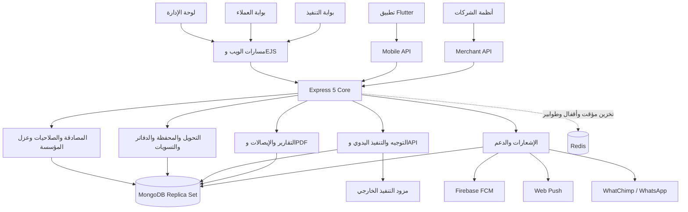

<div align="center">

# Al-Ahram Pay

### منظومة تشغيل وإدارة التحويلات والمدفوعات متعددة القنوات

[](https://github.com/frpbypassen-rgb/vodafone-cash-v2/actions/workflows/ci-cd.yml)
[](https://nodejs.org/)
[](https://expressjs.com/)
[](https://www.mongodb.com/)
[](mobile_app/)

**الإدارة، العملاء، الشركات، الوكلاء، شركات التنفيذ، تطبيق الهاتف، Merchant API، التقارير والإشعارات في منصة واحدة.**

</div>

---

## المحتويات

- [نظرة عامة](#نظرة-عامة)
- [قنوات المنظومة](#قنوات-المنظومة)
- [آلية العمل الكاملة](#آلية-العمل-الكاملة)
- [أنواع الحسابات والصلاحيات](#أنواع-الحسابات-والصلاحيات)
- [الخدمات المالية](#الخدمات-المالية)
- [المحاسبة والأرصدة](#المحاسبة-والأرصدة)
- [التسعير وتغيير أسعار الصرف](#التسعير-وتغيير-أسعار-الصرف)
- [التنفيذ اليدوي والتنفيذ عبر API](#التنفيذ-اليدوي-والتنفيذ-عبر-api)
- [الإيصالات والإشعارات والدعم](#الإيصالات-والإشعارات-والدعم)
- [البنية التقنية](#البنية-التقنية)
- [الأمان وضوابط الإنتاج](#الأمان-وضوابط-الإنتاج)
- [التشغيل المحلي](#التشغيل-المحلي)
- [تشغيل تطبيق Flutter](#تشغيل-تطبيق-flutter)
- [النشر على Windows باستخدام PM2](#النشر-على-windows-باستخدام-pm2)
- [النشر باستخدام Docker](#النشر-باستخدام-docker)
- [CI/CD](#cicd)
- [الاختبارات والمراقبة](#الاختبارات-والمراقبة)
- [واجهات API](#واجهات-api)
- [النسخ الاحتياطي والرجوع](#النسخ-الاحتياطي-والرجوع)
- [استكشاف الأعطال](#استكشاف-الأعطال)
- [الوثائق المرجعية](#الوثائق-المرجعية)

## نظرة عامة

`Al-Ahram Pay` نظام مالي تشغيلي لإدارة طلبات التحويل من لحظة إنشاء الحساب حتى تنفيذ العملية وإصدار الإيصال والتسوية والمراجعة. يتكون المشروع من خادم مركزي مبني بـNode.js وExpress، بوابات ويب مبنية بـEJS، تطبيق Flutter، قاعدة MongoDB، طبقة إشعارات، وتكاملات خارجية للتنفيذ والرسائل.

المنظومة مصممة لخدمة السيناريوهات التالية:

- عميل مباشر يتعامل مع شركة الأهرام.
- شركة لها مدير وموظفون ومحاسبون.
- وكيل يدير عملاء تابعين له وحدودهم الائتمانية وتسوياتهم وهوامش ربحهم.
- شركة تنفيذ لها مدير تنفيذي وموظفون ومحاسبون.
- منفذ يدوي أو منفذ API مخصص لخدمة محددة.
- شركة خارجية تتكامل عبر Merchant API لإنشاء العمليات وتتبعها.
- إدارة مركزية تتحكم في الحسابات والأسعار والتوجيه والإلغاء والتقارير والتدقيق.

> [!IMPORTANT]
> هذه منظومة مالية خاصة. لا تضع بيانات دخول أو مفاتيح API أو أسرار Firebase/WhatsApp أو ملف `.env` داخل Git، ولا تنفذ اختبارات مالية حقيقية على الإنتاج دون موافقة وخطة عكس موثقة.

## قنوات المنظومة

| القناة | المسار أو المجلد | الغرض |
|---|---|---|
| لوحة الإدارة | `/login` ثم صفحات الإدارة | إدارة العمليات والحسابات والأسعار والمنفذين والتقارير والتدقيق |
| بوابة العملاء | `/client/login` | العملاء والشركات والوكلاء والموظفون والمحاسبون |
| بوابة التنفيذ | `/executor-portal/login` | استقبال المهام وتنفيذها والتقارير والموظفون والدعم |
| تطبيق الهاتف | [`mobile_app/`](mobile_app/) | واجهات العميل والوكيل والشركة والمنفذ حسب نوع الحساب |
| Mobile API | `/api/mobile` و`/api/v1/mobile` | المصادقة، التحويلات، التقارير، الدعم، الأجهزة والإشعارات |
| Merchant API | `/api/v1/merchant` | رصيد الشريك، إنشاء تحويل، والاستعلام عن الحالة |
| Swagger | `/api-docs` | استعراض العقود المتاحة على الخادم |
| مراقبة التشغيل | `/health`, `/health/ready`, `/metrics`, `/system-monitor` | الجاهزية والمقاييس وحالة مكونات النظام |

## آلية العمل الكاملة

### 1. إنشاء الحساب والموافقة

1. يختار المستخدم نوع التسجيل: عميل مباشر، عميل تابع لوكيل، شركة، أو وكيل.
2. تتحقق المنظومة من اكتمال البيانات ومن عدم تعارض الهوية النشطة.
3. عميل الوكيل يدخل كود الوكيل، وتعرض له هوية الوكيل قبل إكمال الطلب.
4. يسجل الطلب بالحالة المناسبة مثل `pending` أو `pending_agent`.
5. تعتمد الجهة المسؤولة الطلب أو ترفضه؛ الطلب المحسوم لا يبقى ضمن قائمة الطلبات المعلقة.
6. عند إعادة التسجيل ببيانات حساب محذوف، تحفظ الإشارة التاريخية للحساب السابق دون منع إنشاء طلب مراجعة جديد.
7. ينشئ مدير الشركة أو الوكيل أو شركة التنفيذ حسابات موظفيه وفق الصلاحيات المتاحة له.

### 2. تسجيل الدخول والجلسة

1. بوابات الويب تستخدم جلسات مخزنة في MongoDB وCookies آمنة في الإنتاج.
2. تطبيق الهاتف يستخدم Access Token قصير الصلاحية وRefresh Token يتم تدويره عند التجديد.
3. يتحقق الخادم من حالة الحساب، المؤسسة التابعة له، وإصدار الجلسة قبل قبول الطلب.
4. يمكن تسجيل الخروج من الأجهزة الأخرى مع إبقاء الجهاز الحالي حسب مسار الحساب.
5. في الإنتاج يكون OTP مفعلًا، وتكون جميع مفاتيح التجاوز أو الرموز العامة معطلة بسياسة بدء تشغيل إلزامية.

### 3. تحميل عقد الحساب والأسعار

بعد المصادقة يعيد الخادم عقدًا مناسبًا لنوع الحساب يتضمن:

- بيانات الهوية والحساب والحالة.
- الرصيد والحد الائتماني وفق الصلاحية.
- الخدمات المتاحة وأسعارها الفعلية لهذا الحساب.
- صلاحيات العرض والتنفيذ والتقارير وإدارة الموظفين.
- التنبيهات وحملات الأسعار النشطة.

مستوى التسعير قيمة داخلية سرية؛ يرسل الخادم السعر النهائي فقط ولا يرسل اسم المستوى أو رقمه للعميل أو الشركة أو الوكيل.

### 4. إنشاء عملية تحويل

1. يختار المستخدم الخدمة والفرع المناسب لها.
2. تتحقق الواجهة والخادم من الحقول الخاصة بالخدمة، رقم المستفيد، القيمة، العملة والمرفقات المطلوبة.
3. يحسب الخادم السعر النهائي وتكلفة العملية بالدينار الليبي؛ حساب الخادم هو المرجع وليس ناتج الواجهة وحدها.
4. تطبق سياسة منع التكرار الزمني للرقم والقيمة، بالإضافة إلى `Idempotency-Key` للطلبات المالية.
5. يتحقق الخادم من الرصيد والحد الائتماني ومن حالة الحساب والمنظومة.
6. تنفذ الكتابات المالية الحرجة داخل MongoDB Transaction عند تفعيل متطلبات الإنتاج.
7. ينشأ رقم عملية فريد وتدخل العملية عادة بالحالة `pending`.

### 5. الخصم والتوجيه

- العميل المباشر: تخصم تكلفة العملية من حسابه وفق السعر المطبق.
- حساب الشركة: تنسب العملية إلى الشركة والموظف الذي أنشأها، مع تطبيق صلاحيات العرض الخاصة بالدور.
- عميل تابع لوكيل: تخصم تكلفة العميل من رصيده، وتنعكس تكلفة الوكالة على حساب الوكيل، ويسجل فرق التسعير كربح للوكالة.
- يمكن السماح بالرصيد السالب حتى الحد الائتماني المحدد، ولا يجوز تجاوز هذا الحد.
- يوجه الطلب إلى منفذ يدوي أو API يدعم نفس الخدمة، يدويًا أو آليًا وفق قواعد الإعدادات.

### 6. تنفيذ المهمة

1. يصل الطلب إلى مجموعة التنفيذ مع تسجيل `executorReceivedAt` لحساب زمن الوصول والتنفيذ.
2. في وضع السحب المفتوح يراه الموظفون المؤهلون، ويظهر رقم المستفيد مخفيًا قبل القبول.
3. القبول ذري: أول موظف يقبل المهمة يملكها، وتظهر لبقية الموظفين باسم من سحبها دون السماح بقبولها مرة أخرى.
4. لا يقبل المنفذ مهمة جديدة قبل حسم مهمته النشطة.
5. في وضع التوجيه اليدوي لا تظهر المهام للموظفين تلقائيًا؛ يختار المدير الموظف المطلوب ثم يقبلها الموظف.
6. بعد القبول يظهر الرقم كاملًا، ويمكن للمنفذ نسخ الرقم والقيمة وإكمال العملية أو إلغاؤها أو إرجاعها وفق الصلاحية.
7. عند الإكمال يسجل رقم التنفيذ، المرجع، الوقت، الموظف والمرفقات الداخلية.

### 7. النجاح أو الإلغاء

عند النجاح:

- تتحول العملية إلى `completed` بعد تحقق مسار التنفيذ.
- يحفظ الرقم المرجعي ومدة التنفيذ والمنفذ المنفذ.
- يولد إيصال نجاح قابل للعرض والتنزيل والمشاركة.
- يرسل إشعار داخل المنظومة، ويمكن إرسال الإيصال إلى WhatsApp إذا كان التكامل والقالب صالحين.

عند الإلغاء:

- يختار المنفذ أو الإدارة سبب الإلغاء المسموح أو يكتب سببًا آخر.
- ينشأ رقم إلغاء مستقل وتسجل هوية الملغي والوقت والسبب.
- يعاد المبلغ من خلال خدمة العكس المالي، ولا يعدل السجل المالي الأصلي بصمت.
- يولد إيصال إلغاء عربي يوضح السبب، ويبلغ العميل لاتخاذ الإجراء المطلوب.

### 8. التقارير والتسوية والتدقيق

- تعرض التقارير العمليات الناجحة منفصلة عن الملغاة حتى لا تدخل الملغاة في مجاميع النجاح.
- تعرض الإيداعات والخصومات كحركات مستقلة، مع حفظ عملية الإبطال في السجل المالي بدل حذف التاريخ.
- تقارير الموظف مقيدة بعملياته وصلاحياته؛ تقارير المدير والمحاسب تتبع نطاق المجموعة المسموح.
- تدعم الوكالة شاشات أرصدة العملاء، الديون، حساب الوكالة، المركز المالي، الأرباح والتسويات.
- يسجل `AuditLog` التغييرات الإدارية والمالية المهمة مع الفاعل والسياق والبيانات قبل/بعد عند توفرها.

### حالات العملية

| الحالة الداخلية | معناها التشغيلي |
|---|---|
| `pending` | طلب جديد ينتظر التوجيه أو السحب |
| `processing` | دخل مسار المعالجة أو التوجيه ولم يحسم بعد |
| `accepted` | سحبه منفذ محدد وأصبح مسؤولًا عن إكماله |
| `completed` | اكتمل التنفيذ وحفظ المرجع وأصبح الإيصال متاحًا |
| `rejected` | ألغي من مسار التنفيذ مع سبب وعكس مالي عند انطباقه |
| `cancelled_by_admin` | ألغته الإدارة مع رقم إلغاء وسجل تدقيق |
| `deposit_pending` | طلب إيداع ينتظر الاعتماد |
| `deposit` | حركة إيداع معتمدة |
| `deduction` | حركة خصم معتمدة |

## أنواع الحسابات والصلاحيات

| نوع الحساب | أهم الصلاحيات |
|---|---|
| الإدارة | إدارة الحسابات، الأسعار، العمليات، التوجيه، الإلغاء، المنفذين، التقارير، الدعم وسجل التدقيق |
| عميل مباشر | التحويل، التحويل بين الحسابات، الأسعار، التقارير، الإيصالات، الملف الشخصي والدعم |
| مدير شركة | وظائف العميل مع إدارة موظفي الشركة ومراجعة عملياتها وتقاريرها وإعداداتها |
| موظف شركة | إنشاء عمليات ضمن الشركة وعرض النطاق المسموح دون صلاحيات مالية إدارية |
| محاسب شركة | التقارير والحركات المالية التي تسمح بها سياسة الشركة دون مهام تشغيل غير مصرح بها |
| وكيل | إدارة العملاء التابعين، الحدود الائتمانية، التسويات، التسعير المخصص، الأرباح والموظفين |
| عميل وكيل | واجهة العميل، بسعر وحد ائتماني وربط محاسبي يحدده الوكيل |
| مدير تنفيذ | رصيد مجموعة التنفيذ، المهام، التوجيه اليدوي، التقارير وإدارة الموظفين |
| موظف تنفيذ | قبول مهمة واحدة وتنفيذها، وتقاريره الخاصة وفق السياسة |
| محاسب تنفيذ | رصيد وتقارير المجموعة دون استقبال مهام التنفيذ |
| شريك Merchant API | الاستعلام عن الرصيد وإنشاء التحويل وتتبع الحالة ضمن المؤسسة المرتبطة بالمفتاح |

الصلاحية النهائية لا تؤخذ من الواجهة؛ يتحقق منها الخادم في كل مسار محمي.

## الخدمات المالية

الخدمات المعروضة في تطبيق الهاتف مصدرها المركزي [`utils/mobileTransferServiceCatalog.js`](utils/mobileTransferServiceCatalog.js):

| المفتاح | الخدمة | العملة الأساسية | أهم البيانات |
|---|---|---|---|
| `vodafone` | محافظ كاش | EGP | رقم المحفظة والقيمة |
| `post_account` | بريد حساب | EGP | اسم المستفيد ورقم الحساب البريدي والقيمة |
| `post_card` | بريد بطاقة | EGP | الاسم والرقم القومي والقيمة وصورة البطاقة |
| `bank_account` | تحويل بنكي أو إنستاباي | EGP | الاسم ورقم الحساب/IBAN أو معرف إنستاباي والبنك والقيمة |
| `sefa_niger` | سيفا النيجر | XOF | `NITA` أو `NITA ACCOUNT`، الاسم ورقم الحساب، والمدينة عند الحاجة |
| `bankak_sudan` | بنكك السودان | SDG | الاسم ورقم الحساب وهاتف المستلم والقيمة |
| تحويل داخلي | تحويل بين حسابات المنظومة | LYD | كود/رقم الحساب، التحقق من المستفيد، القيمة والملاحظة |

تتضمن واجهات الخدمات فروعًا مثل بريد حساب/بطاقة وNITA/NITA ACCOUNT، بينما يحتفظ الخادم بمفتاح خدمة موحد للتحقق والتسعير والتوجيه.

## المحاسبة والأرصدة

### مبادئ الرصيد

- الرصيد قد يكون موجبًا أو سالبًا وفق الحد الائتماني؛ السالب غير مسموح بلا حد معتمد.
- جميع الحسابات المالية تتم على الخادم باستخدام القيم المخزنة وقت العملية.
- قيم العملة الأصلية وتكلفة الدينار وسعر الصرف تحفظ منفصلة لتجنب خلط العملات.
- الإيداع والخصم والإلغاء والعكس أحداث مالية قابلة للتتبع وليست تغييرات مخفية في الرصيد.
- سجلات `Ledger` و`AgencyJournal` محمية في الإنتاج من التعديل أو الحذف المباشر؛ التصحيح يتم بقيد أو حدث عكسي.

### محاسبة الوكالة

عند تنفيذ عميل تابع لوكيل عملية:

1. يحسب سعر العميل بعد هامش الوكيل الخاص بهذا العميل والخدمة.
2. تخصم تكلفة العميل من حساب العميل حتى حده الائتماني.
3. تسجل تكلفة الوكالة على حساب الوكيل وفق سعر عقده.
4. يسجل الفرق المحقق في دفتر الوكالة كربح مرتبط بالعملية.
5. تسوية الوكيل مع العميل تسجل كحدث مستقل له مرجع وطريقة دفع وبيان.

### منع التكرار

- الطلبات المالية الحساسة تتطلب `Idempotency-Key` صالحًا.
- إعادة نفس المفتاح ونفس الطلب تعيد النتيجة المسجلة دون خصم جديد.
- إعادة المفتاح نفسه ببيانات مختلفة ترفض بتعارض.
- توجد نافذة انتظار إضافية للعمليات المتشابهة حسب الرقم والقيمة لحماية المستخدم من الإرسال المتكرر.

## التسعير وتغيير أسعار الصرف

- تدير الإدارة أسعار الخدمات لكل مستوى داخلي، مع دعم أسعار شركات مخصصة وهوامش عملاء الوكلاء.
- اشتقاقات البريد والحساب البنكي منفصلة عن سعر محافظ الكاش ويمكن ضبطها من الإعدادات.
- سعر سيفا النيجر يستخدم اتجاه `source_to_lyd`؛ باقي الخدمات تستخدم الاتجاه المحدد في عقد الخدمة.
- قبل تفعيل سعر جديد تنشأ حملة تنبيه بمدة قابلة للضبط من 10 إلى 3600 ثانية.
- تحتوي الحملة على السعر القديم والجديد، اتجاه الصعود/الهبوط، وقت التفعيل والعد التنازلي.
- لا تصل الحملة إلا للحسابات المتأثرة بالسعر، ولا يظهر للمستلم اسم المستوى أو رقمه.
- عند انتهاء الوقت يفعل الخادم السعر مرة واحدة، وتتحول الواجهات إلى السعر الحالي الجديد.
- قنوات الحملة الممكنة: إشعار داخل الموقع، Socket.IO، Web Push، FCM لتطبيق الهاتف، وWhatsApp عند اكتمال القالب والتكامل.

## التنفيذ اليدوي والتنفيذ عبر API

### المنفذ اليدوي

- كل مجموعة تنفيذ مرتبطة بخدمة: محافظ كاش، البريد، البنك، سيفا النيجر أو بنكك السودان.
- لكل منفذ يدوي بادئة مرجعية من ثلاثة أرقام، ويولد رقم تسلسلي فريد لعملياته.
- رقم التنفيذ الذي يدخله الموظف يحفظ كاملًا للإدارة، ويستخدم شكل مقنع في الإيصال العام.
- يمكن رفع أكثر من صورة إثبات، وهي اختيارية افتراضيًا؛ خدمة سيفا النيجر تتطلب إثباتًا عند الإكمال.
- مرفقات المنفذ الداخلية تظهر للإدارة فقط. العميل والشركة والوكيل يرون الإيصال النهائي المولد، لا صور العمل الداخلية.
- حذف مجموعة تنفيذ يعني أرشفتها مع حفظ موظفيها وعملياتها وتاريخها المالي.

### منفذ API

- تخزن إعدادات المزود داخل مجموعة تنفيذ مخصصة، ولا تعرض بيانات الاعتماد في الواجهات العامة.
- زر فحص الاتصال يستعلم عن الرصيد المتاح ويخزن نتيجة الاختبار ووقته.
- قبل التنفيذ وبعده يسجل فحص رصيد المزود للمطابقة واكتشاف الفروقات دون إيقاف تدفق العمليات تلقائيًا إلا وفق السياسة.
- نجاح طلب المزود لا يعتمد على HTTP فقط؛ يحفظ المرجع الخارجي وتتابع دورة الحالة حتى التأكيد.
- يسجل فحص العمليات المسترجعة من المزود لمراجعة الإدارة قبل الإلغاء والعكس.
- التكامل الحالي المخصص موجود في `services/zaynpayApi.js`، وتبقى طبقة التنفيذ العامة في خدمات دورة API والمطابقة.

### التوجيه

- التوجيه التلقائي يربط كل خدمة بمنفذ نشط يدعمها.
- التوجيه اليدوي داخل شركة التنفيذ يحول قائمة السحب إلى قائمة يوزعها المدير على موظف محدد.
- قفل القبول يمنع امتلاك موظفين للمهمة نفسها، كما يمنع الموظف من قبول مهمة ثانية قبل حسم مهمته الحالية.

## الإيصالات والإشعارات والدعم

### الإيصالات

- إيصال نجاح موحد للعمليات اليدوية وAPI.
- إيصال إلغاء عربي مستقل يتضمن رقم الإلغاء والسبب.
- إيصال إيداع وإيصال تحويل داخلي.
- روابط مشاركة موقعة بمدة صلاحية ولا تكشف مسارات الملفات الداخلية.
- لا تعرض إيصالات العميل سعر التكلفة أو بيانات المنفذ الداخلية.

### الإشعارات

| القناة | الاستخدام | متطلبات التشغيل |
|---|---|---|
| داخل الموقع | العمليات، الإيداعات، الدعم وتغيير الأسعار | جلسة نشطة واتصال بالخادم |
| Socket.IO | تحديث حي للواجهات المفتوحة | اتصال WebSocket صالح |
| Web Push | تنبيه المتصفح عند غلق الصفحة | مفاتيح VAPID واشتراك المتصفح وإذنه |
| FCM | إشعارات تطبيق الهاتف في الخلفية | مشروع Firebase، Service Account، إعداد التطبيق وإذن الهاتف |
| WhatsApp/WhatChimp | OTP، الإيصالات، الأسعار والدعم | رمز المنصة، رقم الهاتف، Webhook وقوالب معتمدة عند الحاجة |

رسائل WhatsApp الاستباقية خارج نافذة المحادثة تخضع لقواعد Meta وتتطلب قالبًا معتمدًا. قبول WhatChimp للطلب لا يعني التسليم النهائي؛ تتم متابعة حالات القبول والتسليم والفشل من Webhook وشاشة المراقبة.

### الدعم

- تذاكر منفصلة للعملاء والمنفذين مع رسائل وردود وحالة للتذكرة.
- تشخيص للمنفذ يعرض حالة الاتصال والإشعارات دون كشف الأسرار.
- يمكن مزامنة رسائل WhatsApp الواردة مع تذاكر الدعم عند ضبط Webhook والتحقق من توقيعه.
- رد الإدارة يحفظ داخل صفحة حساب العميل، ويرسل إلى WhatsApp عندما تسمح نافذة المحادثة أو القالب المعتمد.

## البنية التقنية



### هيكل المستودع

```text
vodafone-cash-v2/
|-- app.js                     نقطة تشغيل الخادم وربط المسارات
|-- config/                    قاعدة البيانات، Redis، CORS وسياسة الإنتاج
|-- controllers/               منطق طلبات بوابات الويب
|-- routes/                    مسارات الإدارة والعملاء والمنفذين وواجهات API
|-- middlewares/               المصادقة، CSRF، العزل، السجلات وحدود الطلبات
|-- services/                  التحويل، الرصيد، التوجيه، التقارير والتكاملات
|-- repositories/              الوصول المنظم إلى البيانات
|-- models/                    نماذج MongoDB والفهارس
|-- validators/                التحقق من مدخلات الويب وAPI
|-- views/                     قوالب EJS للبوابات
|-- public/                    ملفات الواجهة العامة
|-- mobile_app/                تطبيق Flutter
|-- tests/                     اختبارات الوحدة والتكامل والأمان
|-- scripts/                   الفحص والهجرة والتهيئة وأدوات التشغيل
|-- monitoring/                أدوات ومخرجات المراقبة
|-- docs/                      الوثائق التشغيلية والتكاملية
|-- .github/workflows/         فحص CI وبوابة النشر
|-- Dockerfile                 صورة الخادم
|-- docker-compose.prod.yml    Mongo Replica Set وRedis والخادم
`-- ecosystem.config.js        إعداد PM2 وتوقيت ليبيا
```

## الأمان وضوابط الإنتاج

الحماية الحالية مبنية على طبقات، ولا تعتبر بديلًا عن مراجعة أمنية مستقلة قبل الإطلاق المالي العام:

- فشل مغلق عند وجود إعدادات إنتاج ضعيفة أو مفاتيح OTP تجاوز أو جلسة غير آمنة.
- تشفير كلمات المرور بـbcrypt وعدم تخزينها كنص صريح.
- جلسات ويب في MongoDB مع Cookies آمنة، وCSRF لطلبات الويب المعدلة للبيانات.
- Access/Refresh Tokens للتطبيق، مع تدوير Refresh Token وكشف إعادة استخدامه.
- `Idempotency-Key` وبصمة طلب للعمليات المالية الحساسة.
- معاملات MongoDB للخصم والعكس، مع فحص مسبق لدعم Replica Set أو Mongos.
- عزل `tenantId` والتحقق من ارتباط الحساب والرمز بالمؤسسة.
- حماية سجلات Ledger وAgencyJournal من التعديل والحذف المباشر في الإنتاج.
- Helmet وCORS وقواعد Rate Limit وقفل الحساب عند المحاولات المشبوهة.
- حماية `/metrics` و`/system-monitor` والوصول إلى صور الإثبات.
- تنقية مركزية للسجلات لإخفاء كلمات المرور والرموز والأسرار.
- سجل تدقيق للأحداث الإدارية والمالية المهمة.

### متطلبات إلزامية قبل الإنتاج

1. MongoDB يعمل كـReplica Set أو Sharded Cluster.
2. `.env` موجود على الخادم فقط، بصلاحيات مقيدة، وجميع أسراره قوية وفريدة.
3. `SESSION_STORE=mongo` و`SECURE_COOKIE=true` خلف HTTPS.
4. `MONGO_TRANSACTIONS_REQUIRED=true` و`TENANT_ISOLATION_REQUIRED=true`.
5. جميع خيارات تجاوز OTP تساوي `false` و`FORCE_CLIENT_OTP=true`.
6. نسخة احتياطية مشفرة ومختبرة الاستعادة قبل كل نشر مالي.
7. نجاح CI وفحوص البيئة والمعاملات والهجرة قبل إعادة التشغيل.

## التشغيل المحلي

### المتطلبات

| المكون | الحد الأدنى أو التوصية |
|---|---|
| Node.js | `>=20.19.0`؛ تستخدم CI نسختي 20 و22 |
| npm | النسخة المرفقة مع Node.js المدعوم |
| MongoDB | Replica Set موصى به ومطلوب لمحاكاة الإنتاج المالي |
| Redis | اختياري في تشغيل عملية واحدة؛ مطلوب في تركيب Docker الإنتاجي الحالي |
| Flutter | إصدار يدعم Dart `^3.12.2` عند تطوير التطبيق |
| Chrome/Chromium | مطلوب لتوليد PDF عبر Puppeteer |

### التثبيت على Windows PowerShell

```powershell
git clone https://github.com/frpbypassen-rgb/vodafone-cash-v2.git
cd vodafone-cash-v2
npm ci
Copy-Item .env.example .env
```

عدّل `.env` بقيم محلية حقيقية، ثم نفذ:

```powershell
npm run audit:env
npm run check:mongo-transactions
npm run dev
```

الروابط المحلية الافتراضية:

- الإدارة: `http://127.0.0.1:3000/login`
- العملاء: `http://127.0.0.1:3000/client/login`
- المنفذون: `http://127.0.0.1:3000/executor-portal/login`
- Swagger: `http://127.0.0.1:3000/api-docs`
- Health: `http://127.0.0.1:3000/health`

لا تستخدم حسابات أو مفاتيح الإنتاج في بيئة التطوير.

## تشغيل تطبيق Flutter

```powershell
cd mobile_app
flutter pub get
flutter analyze
flutter test
flutter run --dart-define=API_BASE_URL=http://127.0.0.1:3000/api/mobile
```

عند التشغيل على هاتف حقيقي، لا يشير `127.0.0.1` إلى جهاز التطوير. استخدم عنوان IP يمكن للهاتف الوصول إليه أو خادم HTTPS:

```powershell
flutter run --dart-define=API_BASE_URL=https://ahrampay.com/api/mobile
```

لبناء Android Release:

```powershell
flutter build apk --release --dart-define=API_BASE_URL=https://ahrampay.com/api/mobile
```

يتطلب FCM تعريف قيم Firebase الخاصة بالتطبيق أثناء البناء أو ملفات المنصة الصحيحة. راجع `mobile_app/lib/firebase_options.dart` ولا تضع Service Account الخاص بالخادم داخل APK.

## إعداد متغيرات البيئة

استخدم [`.env.example`](.env.example) كفهرس، وليس كملف إنتاج جاهز. أهم المجموعات:

| المجموعة | أمثلة المفاتيح |
|---|---|
| قاعدة البيانات | `MONGO_URI` |
| المصادقة | `JWT_SECRET`, `JWT_REFRESH_SECRET`, `SESSION_SECRET`, `OTP_SECRET` |
| سياسة الإنتاج | `NODE_ENV`, `SECURE_COOKIE`, `SESSION_STORE`, `MONGO_TRANSACTIONS_REQUIRED` |
| عزل المؤسسات | `TENANT_ISOLATION_REQUIRED`, `TENANT_MODE`, `DEFAULT_TENANT_SLUG`, `TENANT_ROUTING_SECRET` |
| الرابط العام | `PUBLIC_APP_URL`, `RECEIPT_SHARE_SECRET` |
| Web Push | `WEB_PUSH_PUBLIC_KEY`, `WEB_PUSH_PRIVATE_KEY`, `WEB_PUSH_SUBJECT` |
| Firebase | `FCM_ENABLED`, `FIREBASE_SERVICE_ACCOUNT_BASE64` أو الحقول المنفصلة |
| WhatChimp | `WHATCHIMP_ENABLED`، رمز API، رقم الهاتف، أسماء القوالب وWebhook Secret |
| Redis | `REDIS_ENABLED`, `REDIS_REQUIRED`, `REDIS_URL`, `REDIS_PASSWORD` |
| المراقبة | `METRICS_AUTH_TOKEN`, `SYSTEM_MONITOR_AUTH_TOKEN` |

لتوليد سر قوي محليًا:

```powershell
node -e "console.log(require('crypto').randomBytes(64).toString('hex'))"
```

لا تطبع قيم الأسرار في السجلات أو المحادثات أو لقطات الشاشة.

## النشر على Windows باستخدام PM2

خذ نسخة احتياطية أولًا، ثم نفذ الأوامر منفصلة من PowerShell:

```powershell
cd C:\Users\Administrator\Desktop\vodafone-cash-v2
git status --short
git fetch origin
git checkout main
git pull --ff-only origin main
npm ci --omit=dev
node scripts/repairProductionEnv.js .env --apply
node scripts/ensureWebPushKeys.js
node scripts/auditProductionEnv.js .env
node scripts/checkMongoTransactionSupport.js .env
node scripts/migrateTenantIsolation.js --apply --create-default
pm2 restart ecosystem.config.js --env production --update-env
pm2 save
pm2 status
curl.exe -fsS http://127.0.0.1:3000/health
```

> [!NOTE]
> لا تستخدم `||` في Windows PowerShell 5. إذا لم يكن التطبيق مسجلًا في PM2، نفذ `pm2 start ecosystem.config.js --env production` كأمر منفصل. وإذا ظهر أن `pm2` غير معروف، ثبته لحساب تشغيل الخدمة باستخدام `npm install -g pm2` ثم افتح جلسة PowerShell جديدة.

إعداد PM2 الحالي يشغل عملية واحدة بوضع `fork` وتوقيت `Africa/Tripoli`. لا ترفع عدد العمليات قبل توفير Redis مشترك والتأكد من توافق الجلسات والأقفال والطوابير وSocket.IO.

## النشر باستخدام Docker

يهيئ [`docker-compose.prod.yml`](docker-compose.prod.yml) خادم التطبيق، MongoDB Replica Set وRedis محميًا بكلمة مرور.

قبل التشغيل اضبط على الأقل في `.env`:

```dotenv
NODE_ENV=production
MONGO_URI=mongodb://mongo_db:27017/vodafone_cash_system?replicaSet=rs0
REDIS_ENABLED=true
REDIS_REQUIRED=true
REDIS_PASSWORD=REPLACE_WITH_A_STRONG_SECRET
```

ثم:

```powershell
docker compose -f docker-compose.prod.yml up -d --build
docker compose -f docker-compose.prod.yml ps
docker compose -f docker-compose.prod.yml logs --tail 100 ahram_core_prod
```

إذا كان أمر `docker` غير معروف فهذا يعني أن Docker غير مثبت أو غير موجود في `PATH`؛ استخدم مسار PM2 على Windows بدل تشغيل أوامر Docker غير المتاحة.

## CI/CD

ملف [`.github/workflows/ci-cd.yml`](.github/workflows/ci-cd.yml) ينفذ عند Push أو Pull Request إلى `main`/`master`:

1. ESLint على Node.js 20.
2. فحص تبعيات الإنتاج واختبارات الأمان.
3. مجموعة Jest كاملة على Node.js 20 و22 مع Coverage.
4. بناء صورة Docker واختبار `/health` داخل الحاوية.
5. بوابة نهائية تفشل إذا فشلت أي مرحلة مطلوبة.

ملف [`.github/workflows/deploy.yml`](.github/workflows/deploy.yml) لا ينشر إلا Commit اجتاز CI نفسه. يتطلب GitHub Secrets التالية:

- `DEPLOY_HOST`
- `DEPLOY_USER`
- `DEPLOY_SSH_KEY`
- `DEPLOY_PATH`
- `DEPLOY_PORT` اختياري
- `DEPLOY_RESTART_COMMAND` أو `DEPLOY_SYSTEMD_SERVICE`
- `APP_RUNTIME_ENV_BASE64` اختياري لتحديث قائمة محدودة من إعدادات التكامل

مسار النشر الحالي مكتوب لخادم Remote Shell متوافق مع Bash. خادم Windows/PowerShell يستخدم خطوات PM2 أعلاه أو يحتاج Runner/Workflow مخصصًا؛ لا تفترض أن Workflow الحالي سيعمل على Windows دون تهيئة.

## الاختبارات والمراقبة

### أوامر الجودة

```powershell
npm run lint
npm run test:security
npm test
```

آخر خط أساس متحقق منه وقت تحديث هذه الوثيقة: **107 مجموعة اختبار و591 اختبارًا ناجحًا**. الرقم مرجعي وقد يتغير؛ نتيجة GitHub Actions للـCommit الجاري هي المرجع النهائي.

### فحوص الإنتاج

```powershell
npm run audit:env
npm run check:mongo-transactions
node scripts/migrateTenantIsolation.js
node scripts/verifyAuditChain.js
```

تشغيل `migrateTenantIsolation.js` دون `--apply` هو معاينة. راجع الناتج والنسخة الاحتياطية قبل التطبيق.

### نقاط المراقبة

| المسار | الغرض | الحماية |
|---|---|---|
| `/health` | حياة العملية والاتصال الأساسي | مناسب لموازن الحمل |
| `/health/ready` | جاهزية الاعتماديات | مناسب لفحص الجاهزية |
| `/metrics` | مقاييس Prometheus | Localhost أو Token تشغيلي |
| `/system-monitor` | شاشة حالة التشغيل | مصادقة تشغيلية |

السجلات المنظمة تكتب عبر Winston مع `correlationId` للربط بين الطلب والخطأ. لا تعتبر رسالة قبول مزود خارجي دليل تسليم نهائي؛ تابع الحالة النهائية في شاشة المراقبة وسجلات Webhook.

## واجهات API

### Mobile API

المسار الأساسي: `/api/mobile`، مع Alias متوافق: `/api/v1/mobile`.

المجموعات الرئيسية:

- `/login`, `/refresh-token`, `/logout`
- `/client/register/*`, `/client/home`, `/client/exchange-rate`
- `/client/transactions`, `/client/reports/*`, `/client/balance-transfer`
- `/client/profile`, `/client/security/*`, `/client/tickets/*`
- `/agent/sub-accounts/*`
- `/executor/live-tasks`, `/executor/accept-task/:id`, `/executor/complete-task/:id`
- `/executor/reports/*`, `/executor/employees/*`, `/executor/support/*`
- `/push/devices/*`, `/push/preferences`, `/push/inbox/*`

العقد المرجعي لتطبيق الهاتف: [`docs/Flutter-Mobile-API-Contract.md`](docs/Flutter-Mobile-API-Contract.md).

### Merchant API

المسار الأساسي: `/api/v1/merchant`.

| الطريقة | المسار | الغرض |
|---|---|---|
| `GET` | `/balance` | الاستعلام عن رصيد الحساب المرتبط |
| `POST` | `/transfer` | إنشاء عملية مع مفتاح منع تكرار ومرجع خارجي |
| `GET` | `/status/:reference_id` | تتبع العملية بالمرجع |

لا تنقل API Token في Query String. استخدم Header الموثق وHTTPS فقط، واحفظ مفاتيح كل شركة في Secret Manager أو بيئة خادمها.

## النسخ الاحتياطي والرجوع

قبل أي نشر يؤثر في المالية أو المخطط:

1. أوقف نافذة العمليات اليدوية والتسويات الجديدة.
2. أنشئ نسخة `mongodump` مشفرة وسجل SHA-256 ووقت النسخة.
3. سجل SHA الحالي والجديد ونتائج CI والفحوص.
4. نفذ الهجرات بالمعاينة ثم `--apply` بعد المراجعة.
5. اختبر تسجيل الدخول وتحويلًا محدودًا والإلغاء والعزل بعد النشر.

مثال نسخة احتياطية على PowerShell:

```powershell
$stamp = Get-Date -Format 'yyyyMMdd-HHmmss'
mongodump --uri $env:MONGO_URI --archive="backup-$stamp.archive" --gzip
Get-FileHash "backup-$stamp.archive" -Algorithm SHA256
```

راجع دليل التشغيل الكامل: [`docs/operations/P0-DEPLOYMENT-RUNBOOK-AR.md`](docs/operations/P0-DEPLOYMENT-RUNBOOK-AR.md).

## استكشاف الأعطال

### `Cannot find module 'dotenv'`

الحزم غير مثبتة أو `node_modules` غير مكتمل:

```powershell
npm ci --omit=dev
pm2 restart ecosystem.config.js --env production --update-env
```

### `pm2 is not recognized`

```powershell
npm install -g pm2
pm2 start ecosystem.config.js --env production
pm2 save
```

### `docker is not recognized`

Docker غير مثبت على الخادم. لا تكرر أوامر Compose؛ استخدم PM2 أو ثبّت Docker Desktop/Engine وفق نظام التشغيل.

### فشل بدء الإنتاج بعد تعديل `.env`

```powershell
node scripts/auditProductionEnv.js .env
node scripts/checkMongoTransactionSupport.js .env
pm2 logs Ahram_Core_API --lines 150
```

سياسة الإنتاج تتعمد إيقاف الخادم عند وجود سر ضعيف، OTP bypass، جلسة غير آمنة، MongoDB دون Transactions، أو إعداد Tenant غير مكتمل.

### فشل MongoDB Transactions

شغل MongoDB كـReplica Set وتأكد أن `MONGO_URI` يحتوي إعداد `replicaSet` الصحيح. MongoDB Standalone غير مناسب لمسارات الخصم والعكس الإنتاجية.

### Endpoint جديد يعيد `404` بعد `git pull`

الكود على القرص محدث لكن عملية Node القديمة لم تعد التشغيل:

```powershell
git rev-parse --short HEAD
pm2 restart ecosystem.config.js --env production --update-env
pm2 status
```

### إشعارات FCM غير مكتملة

تحقق من `FCM_ENABLED` وService Account على الخادم، ومن إعداد Firebase داخل بناء التطبيق، ومن إذن الإشعارات وتسجيل الجهاز. Service Account للخادم لا يوضع داخل التطبيق.

### WhatsApp يقبل الرسالة ولا يسلمها

راجع حالة القالب في Meta، رقم المستلم بصيغة دولية، Phone Number ID، Webhook، نافذة المحادثة وحالة التسليم في شاشة مراقبة WhatsApp. نص "تم قبول الطلب" ليس تأكيد تسليم.

### PDF لا يتم تنزيله

تحقق من تثبيت Chromium/Puppeteer وصلاحية مجلدات الملفات، ثم راجع السجل بحثًا عن `PDF_BROWSER_NOT_FOUND`.

### `Invalid CSRF token`

حدث الصفحة لتجديد الجلسة والرمز، وتأكد من إرسال النموذج من نفس الأصل مع Cookie الجلسة. تطبيق الهاتف يستخدم JWT ولا يعيد استخدام نماذج CSRF الخاصة بالويب.

## الوثائق المرجعية

| الوثيقة | المحتوى |
|---|---|
| [`docs/Architecture.md`](docs/Architecture.md) | البنية المعمارية ومكونات الخادم |
| [`docs/API-Reference.md`](docs/API-Reference.md) | مرجع API العام |
| [`docs/API-Integration-Guide-AR.md`](docs/API-Integration-Guide-AR.md) | دليل ربط الشركات باللغة العربية |
| [`docs/Flutter-Mobile-API-Contract.md`](docs/Flutter-Mobile-API-Contract.md) | عقد تطبيق Flutter ومساراته |
| [`docs/Flutter-Mobile-API.postman_collection.json`](docs/Flutter-Mobile-API.postman_collection.json) | مجموعة Postman لتطبيق الهاتف |
| [`docs/DATABASE.md`](docs/DATABASE.md) | نماذج البيانات والعلاقات |
| [`docs/Deployment.md`](docs/Deployment.md) | دليل النشر العام |
| [`docs/operations/P0-DEPLOYMENT-RUNBOOK-AR.md`](docs/operations/P0-DEPLOYMENT-RUNBOOK-AR.md) | قائمة نشر وفحص ورجوع للإنتاج |
| [`docs/Backup-Recovery.md`](docs/Backup-Recovery.md) | النسخ والاستعادة |
| [`docs/Disaster-Recovery.md`](docs/Disaster-Recovery.md) | التعافي من الكوارث |
| [`docs/WHATCHIMP-INTEGRATION-AR.md`](docs/WHATCHIMP-INTEGRATION-AR.md) | ربط WhatsApp وإرسال OTP والإيصالات |
| [`docs/WHATCHIMP-SUPPORT-WEBHOOK-AR.md`](docs/WHATCHIMP-SUPPORT-WEBHOOK-AR.md) | ربط رسائل الدعم الواردة والصادرة |
| [`docs/Receipt-Visual-Identity-AR.md`](docs/Receipt-Visual-Identity-AR.md) | قواعد الهوية البصرية للإيصالات |

## قواعد المساهمة والتغيير

- افهم دورة العملية والصلاحيات قبل تعديل أي مسار مالي.
- لا تغير اسم Endpoint أو عقد الاستجابة دون تحديث التطبيق والوثائق والاختبارات.
- لا تعدل الرصيد مباشرة؛ استخدم خدمات الرصيد والعكس والتسوية الموجودة.
- أضف `Idempotency-Key` لأي POST مالي جديد.
- اربط كل استعلام مالي أو إداري بـ`tenantId` الصحيح.
- أضف اختبارات للنجاح والفشل والتكرار والصلاحيات والعزل.
- لا ترفع `.env` أو قواعد بيانات أو سجلات حقيقية أو صور إثبات أو ملفات APK/Build إلى Git.
- شغل `npm run lint`, `npm run test:security`, و`npm test` قبل الدمج.

## الملكية والترخيص

المشروع مملوك لصاحبه ومخصص لتشغيل Al-Ahram Pay. يعلن `package.json` حاليًا الترخيص `ISC`، لكن شروط الاستخدام والتوزيع الفعلية تخضع لاتفاقات المالك. يجب إضافة ملف `LICENSE` صريح ومراجع قبل أي توزيع عام للمصدر.

---

| البيان | القيمة |
|---|---|
| الإصدار الخلفي | `2.0.0` |
| إصدار تطبيق Flutter | `1.2.25+30` |
| التوقيت التشغيلي | `Africa/Tripoli` |
| النطاق الإنتاجي | [ahrampay.com](https://ahrampay.com) |
