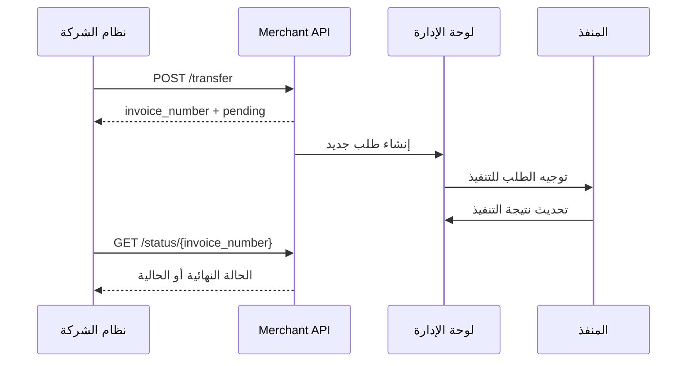

# وثيقة التكامل البرمجي API

## منصة الأهرام Pay

الإصدار: `1.0`

تاريخ الوثيقة: `2026-06-30`

هذه الوثيقة مخصصة للشركات المتعاقدة التي ترغب في ربط أنظمتها مع منصة الأهرام Pay لإرسال طلبات التحويل ومتابعة حالتها آلياً عبر API.

> ملاحظة مهمة: لا تحتوي هذه الوثيقة على مفاتيح تشغيل حقيقية. يتم تسليم `MERCHANT_API_KEY` وقيمة رابط الإنتاج بشكل منفصل عبر قناة آمنة عند توقيع الاتفاق.

---

## 1. نطاق التكامل

واجهة التكامل الخارجي المعتمدة للشركات هي:

```text
/api/v1/merchant
```

تدعم هذه الواجهة العمليات التالية:

1. الاستعلام عن رصيد الشركة وسعر الصرف الحالي.
2. إرسال طلب تحويل جديد.
3. متابعة حالة طلب تحويل سابق باستخدام رقم الفاتورة.

مسارات لوحة الإدارة ومسارات تطبيق الموبايل ليست جزءاً من عقد التكامل الخارجي إلا إذا تم الاتفاق عليها صراحة.

---

## 2. روابط التشغيل

بيئة الاختبار المحلي:

```text
http://127.0.0.1:3000
```

بيئة الإنتاج:

```text
https://<your-production-domain>
```

رابط Swagger الداخلي عند تشغيل الخادم:

```text
https://<your-production-domain>/api-docs
```

رابط تسجيل حسابات المنفذين:

```text
https://<your-production-domain>/executor-portal/register
```

---

## 3. المصادقة

كل طلب إلى Merchant API يجب أن يحتوي على مفتاح الشركة في الهيدر التالي:

```http
x-api-key: <MERCHANT_API_KEY>
```

هيدرز موصى بها:

```http
Content-Type: application/json
Accept: application/json
X-Correlation-Id: <optional-request-id>
```

قواعد الأمان:

1. لا يتم إرسال مفتاح API داخل الرابط أو جسم الطلب.
2. يجب استخدام HTTPS في الإنتاج.
3. يجب حفظ المفتاح في Secret Manager أو متغيرات بيئة، وليس داخل الكود.
4. عند الاشتباه في تسريب المفتاح يجب طلب تدويره فوراً.

---

## 4. تنسيق الاستجابات

استجابة ناجحة:

```json
{
  "status": "success",
  "data": {}
}
```

استجابة خطأ:

```json
{
  "status": "failed",
  "message": "وصف الخطأ"
}
```

---

## 5. العملات وطريقة الحساب

القيم المالية الأساسية:

| الحقل | الوصف |
|---|---|
| `amount_egp` | مبلغ التحويل بالجنيه المصري |
| `exchange_rate` | سعر الصرف المستخدم للعملية |
| `cost_lyd` | تكلفة العملية بالدينار الليبي |
| `balance` | رصيد الشركة بعد تنفيذ الخصم |

طريقة احتساب التكلفة:

```text
cost_lyd = amount_egp / exchange_rate
```

مثال:

```text
amount_egp = 1000
exchange_rate = 6.50
cost_lyd = 153.846
```

يتم تحديد سعر الصرف من إعدادات المنصة حسب نوع الخدمة ومستوى الشركة، ويمكن للإدارة تعيين سعر مخصص لشركة معينة عند الحاجة.

---

## 6. أنواع الخدمات المدعومة

يرسل نوع الخدمة في الحقل `transfer_type`.

| القيمة التقنية | الاسم التجاري |
|---|---|
| `vodafone` | تحويل كاش |
| `post_account` | بريد حساب |
| `post_card` | بريد بطاقة |
| `bank_account` | تحويل بنكي |
| `sefa_niger` | سيفا للنيجر |
| `bankak_sudan` | بنكك للسودان |

إذا لم يتم إرسال `transfer_type` سيتم التعامل مع الطلب كتحويل كاش `vodafone`.

---

## 7. الاستعلام عن الرصيد

### `GET /api/v1/merchant/balance`

يعيد بيانات الشركة، الرصيد المتاح، وسعر الصرف الأساسي الحالي.

مثال الطلب:

```bash
curl -X GET "https://<your-production-domain>/api/v1/merchant/balance" \
  -H "x-api-key: <MERCHANT_API_KEY>" \
  -H "Accept: application/json"
```

مثال الاستجابة:

```json
{
  "status": "success",
  "data": {
    "merchant_name": "شركة المثال",
    "balance": 15000,
    "exchange_rate": 6.5
  }
}
```

---

## 8. إرسال طلب تحويل

### `POST /api/v1/merchant/transfer`

ينشئ طلب تحويل جديد ويخصم تكلفته من رصيد الشركة إذا كان الرصيد كافياً.

جسم الطلب:

```json
{
  "target_number": "01012345678",
  "amount": 1000,
  "transfer_type": "vodafone"
}
```

الحقول:

| الحقل | النوع | إلزامي | الوصف |
|---|---|---:|---|
| `target_number` | string | نعم | رقم المستفيد. في النسخة الحالية يجب أن يكون 11 رقماً |
| `amount` | number | نعم | مبلغ التحويل بالجنيه المصري، ويجب أن يكون أكبر من صفر |
| `transfer_type` | string | لا | نوع الخدمة. القيمة الافتراضية `vodafone` |

مثال الطلب:

```bash
curl -X POST "https://<your-production-domain>/api/v1/merchant/transfer" \
  -H "x-api-key: <MERCHANT_API_KEY>" \
  -H "Content-Type: application/json" \
  -H "Accept: application/json" \
  -d '{
    "target_number": "01012345678",
    "amount": 1000,
    "transfer_type": "vodafone"
  }'
```

مثال الاستجابة:

```json
{
  "status": "success",
  "message": "تم استلام الطلب بنجاح وهو الآن قيد المعالجة",
  "data": {
    "transaction_id": "667a1c2b9b9f5b0012a12345",
    "invoice_number": "ATT-2606-0001",
    "status": "pending",
    "amount_egp": 1000,
    "exchange_rate": 6.5,
    "cost_lyd": 153.846,
    "balance": 14846.154
  }
}
```

ملاحظات مهمة:

1. `invoice_number` هو الرقم المرجعي الرسمي للطلب ويجب حفظه في نظام الشركة.
2. حالة الطلب عند الإنشاء تكون عادة `pending`.
3. الخصم من رصيد الشركة يتم عند قبول الطلب من API إذا كان الرصيد كافياً.
4. في هذه النسخة لا يوجد `Idempotency-Key` مفعل على Merchant API. لذلك يجب على نظام الشركة عدم إعادة إرسال نفس الطلب تلقائياً إذا استلم `invoice_number`.

---

## 9. متابعة حالة طلب

### `GET /api/v1/merchant/status/{reference_id}`

يعيد حالة طلب سابق باستخدام رقم الفاتورة الصادر من النظام.

مثال الطلب:

```bash
curl -X GET "https://<your-production-domain>/api/v1/merchant/status/ATT-2606-0001" \
  -H "x-api-key: <MERCHANT_API_KEY>" \
  -H "Accept: application/json"
```

مثال الاستجابة:

```json
{
  "status": "success",
  "data": {
    "transaction_id": "667a1c2b9b9f5b0012a12345",
    "reference_id": "ATT-2606-0001",
    "target_number": "01012345678",
    "amount_egp": 1000,
    "exchange_rate": 6.5,
    "cost_lyd": 153.846,
    "status": "completed",
    "notes": "تم التنفيذ بنجاح"
  }
}
```

---

## 10. حالات الطلب

| الحالة | المعنى |
|---|---|
| `pending` | الطلب مستلم وينتظر المعالجة أو التوجيه |
| `processing` | الطلب قيد التنفيذ |
| `accepted` | تم استلامه من منفذ أو موظف تنفيذ |
| `completed` | تم تنفيذ الطلب بنجاح |
| `rejected` | تم رفض الطلب |
| `cancelled_by_admin` | تم إلغاء الطلب من الإدارة |

يجب على الشركة اعتبار `completed` فقط كحالة نجاح نهائي.

---

## 11. أكواد HTTP المتوقعة

| الكود | الحالة |
|---:|---|
| `200` | الطلب ناجح |
| `400` | بيانات غير صحيحة، نوع تحويل غير مدعوم، مبلغ غير صالح، أو رصيد غير كاف |
| `401` | مفتاح API مفقود أو غير صحيح أو الحساب موقوف |
| `404` | الرقم المرجعي غير موجود |
| `500` | خطأ داخلي في الخادم |

أمثلة أخطاء:

```json
{
  "status": "failed",
  "message": "مفتاح المصادقة x-api-key مفقود"
}
```

```json
{
  "status": "failed",
  "message": "رصيد التاجر غير كاف لإتمام الطلب"
}
```

```json
{
  "status": "failed",
  "message": "نوع التحويل غير مدعوم"
}
```

---

## 12. دورة حياة الطلب



---

## 13. توصيات التكامل من جهة الشركة

1. حفظ `invoice_number` لكل طلب وعدم الاعتماد على `transaction_id` فقط.
2. عدم إعادة إرسال طلب جديد عند انقطاع الشبكة إلا بعد محاولة الاستعلام عن الحالة إن كان `invoice_number` قد وصل.
3. وضع مهلة اتصال مناسبة مثل 30 ثانية.
4. استخدام Retry بحذر على طلبات الاستعلام فقط.
5. تسجيل `X-Correlation-Id` داخلياً لتسهيل الدعم الفني.
6. عدم تسجيل `x-api-key` في ملفات السجلات.

---

## 14. متطلبات ما قبل التشغيل

قبل الانتقال للإنتاج يجب الاتفاق على:

1. رابط الإنتاج النهائي.
2. مفتاح API الخاص بالشركة.
3. أسماء الخدمات المفعلة لكل شركة.
4. مستوى أسعار الصرف المعتمد أو السعر المخصص.
5. طريقة تمويل الرصيد وحدود الائتمان إن وجدت.
6. أرقام الدعم الفني ومسار التصعيد.
7. هل يلزم إضافة Webhook أو مفتاح منع تكرار `Idempotency-Key` كمتطلب تعاقدي.

---

## 15. ملحق مختصر: API تطبيق الموبايل

واجهة الموبايل الداخلية تستخدم:

```text
/api/mobile
```

المصادقة:

```http
Authorization: Bearer <JWT_TOKEN>
```

أهم المسارات:

| العملية | المسار |
|---|---|
| تسجيل الدخول | `POST /api/mobile/login` |
| تجديد التوكن | `POST /api/mobile/refresh-token` |
| خروج | `POST /api/mobile/logout` |
| صفحة العميل | `GET /api/mobile/client/home` |
| سعر الصرف | `POST /api/mobile/client/exchange-rate` |
| إنشاء تحويل | `POST /api/mobile/client/new-transfer` |
| سجل التحويلات | `GET /api/mobile/client/transactions` |
| مهام المنفذ | `GET /api/mobile/executor/live-tasks` |
| قبول مهمة | `POST /api/mobile/executor/accept-task/:id` |
| إتمام مهمة | `POST /api/mobile/executor/complete-task/:id` |

العمليات المالية في الموبايل تستخدم `Idempotency-Key` لمنع التكرار، وتفاصيلها موجودة في وثيقة الموبايل المنفصلة:

```text
docs/Flutter-Mobile-API-Contract.md
```

---

## 16. بيانات الدعم

يتم تحديد بيانات الدعم النهائية في عقد التشغيل:

```text
Technical Contact: <name>
Email: <email>
Phone/WhatsApp: <phone>
Support Hours: <hours>
```

---

## 17. سجل التغييرات

| الإصدار | التاريخ | التغيير |
|---|---|---|
| `1.0` | `2026-06-30` | الإصدار الأول من وثيقة تكامل Merchant API باللغة العربية |
