# 🏗️ Architecture Documentation — Al-Ahram Pay

> **Version**: 2.0 | **Last Updated**: 2026-06-04 | **Author**: Eng. Mohamed Ali

---

## Table of Contents

1. [System Overview](#system-overview)
2. [C4 Architecture Diagrams](#c4-architecture-diagrams)
3. [Component Architecture](#component-architecture)
4. [Transfer Flow (End-to-End)](#transfer-flow-end-to-end)
5. [Financial Engine (Double-Entry Ledger)](#financial-engine-double-entry-ledger)
6. [Authentication Architecture](#authentication-architecture)
7. [Real-time Communication](#real-time-communication)
8. [Technology Stack](#technology-stack)
9. [Deployment Architecture](#deployment-architecture)
10. [Security Architecture](#security-architecture)
11. [Scalability & Performance](#scalability--performance)
12. [Design Decisions & Trade-offs](#design-decisions--trade-offs)
13. [Directory Structure](#directory-structure)

---

## System Overview

Al-Ahram Pay is an **enterprise-grade financial transfer system** designed for international money transfers between Egypt (EGP) and Libya (LYD). The system implements a **double-entry accounting ledger**, supports multiple client types (individuals, companies, sub-accounts), and integrates with Telegram bots for operations management.

### Key Capabilities

| Capability | Description |
|---|---|
| **Multi-channel Access** | Mobile App (REST API), Web Portals (3), Telegram Bots (3) |
| **Financial Engine** | Double-entry ledger with atomic transactions |
| **Real-time Operations** | WebSocket-based live updates via Socket.IO |
| **Multi-tier Pricing** | 3-tier exchange rate system per client |
| **Automated Execution** | API integration for automated transfers |
| **Enterprise Security** | JWT + Session auth, Helmet, Rate Limiting, Audit Trail |
| **Multi-Tenant Ready** | Tenant isolation support for multiple organizations |

---

## C4 Architecture Diagrams

### Level 1: System Context Diagram

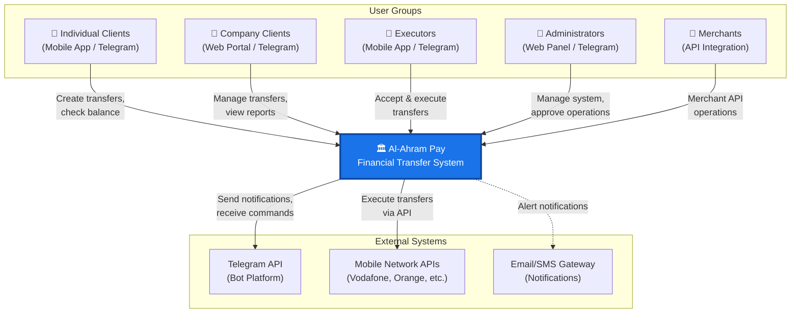

### Level 2: Container Diagram

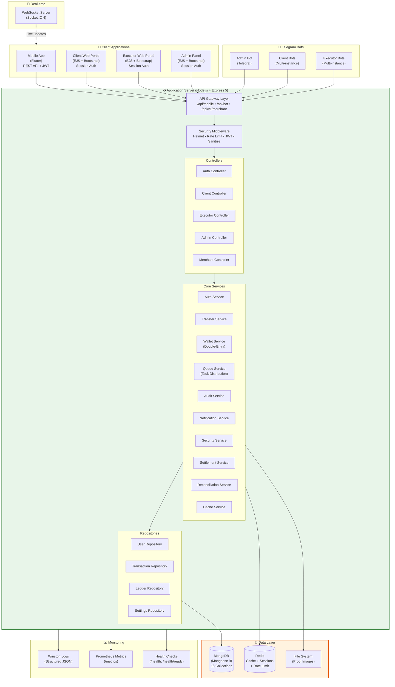

### Level 3: Component Diagram (Core Services)

```mermaid
graph LR
    subgraph Routes ["Routes Layer (18 files)"]
        R1["mobileApi.js<br/>(Mobile REST)"]
        R2["clientPortal.js<br/>(Client Web)"]
        R3["executorPortal.js<br/>(Executor Web)"]
        R4["adminTransactions.js<br/>(Admin Panel)"]
        R5["botApi.js<br/>(Bot Endpoints)"]
        R6["merchantApi.js<br/>(Merchant)"]
    end

    subgraph Controllers ["Controllers Layer"]
        C1["authController"]
        C2["clientController"]
        C3["executorController"]
        C4["adminController"]
        C5["merchantController"]
    end

    subgraph Services ["Services Layer (12+ files)"]
        S1["authService"]
        S2["transferService"]
        S3["walletService<br/>(Double-Entry)"]
        S4["auditService"]
        S5["queueService"]
        S6["notificationService"]
        S7["securityService"]
        S8["settlementService"]
        S9["reconciliationService"]
        S10["cacheService"]
    end

    subgraph Repositories ["Repository Layer"]
        RP1["userRepository"]
        RP2["transactionRepository"]
        RP3["ledgerRepository"]
        RP4["settingsRepository"]
    end

    subgraph Models ["Models Layer (18+ models)"]
        M1["Transaction"]
        M2["Ledger"]
        M3["User"]
        M4["ClientBot"]
        M5["Employee"]
        M6["ExecutorBot"]
        M7["AuditLog"]
        M8["Settings"]
        M9["Settlement"]
        M10["Reconciliation"]
        M11["Tenant"]
    end

    Routes --> Controllers
    Controllers --> Services
    Services --> Repositories
    Repositories --> Models
    Models --> DB[("MongoDB")]
```

---

## Transfer Flow (End-to-End)

### Happy Path: Client → Transfer → Executor → Complete

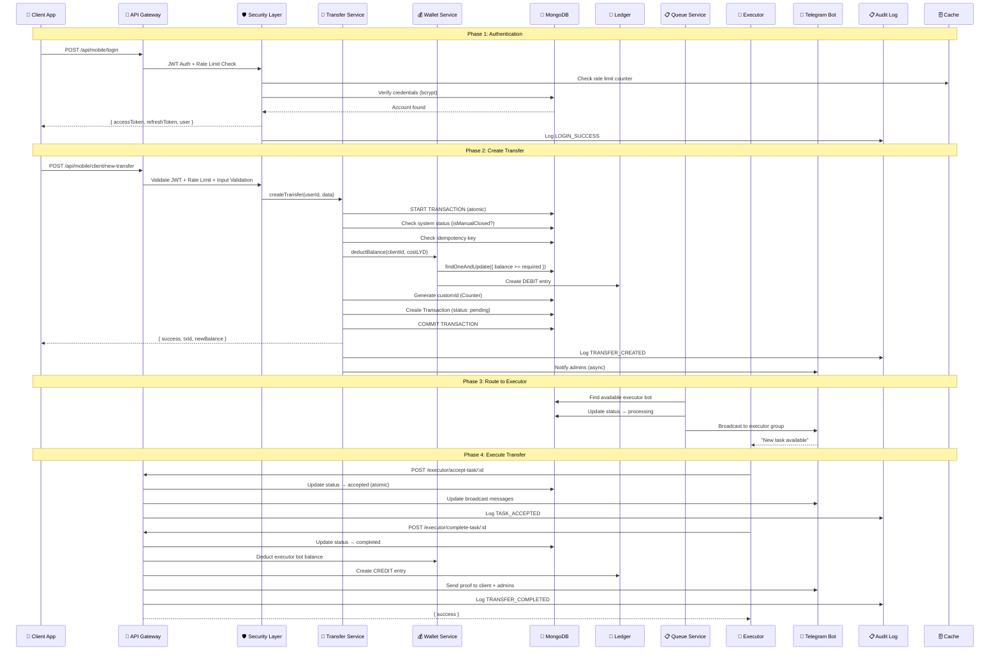

### Cancel/Rollback Flow

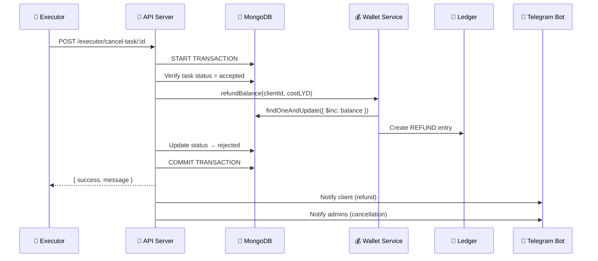

### API Auto-Execution Flow

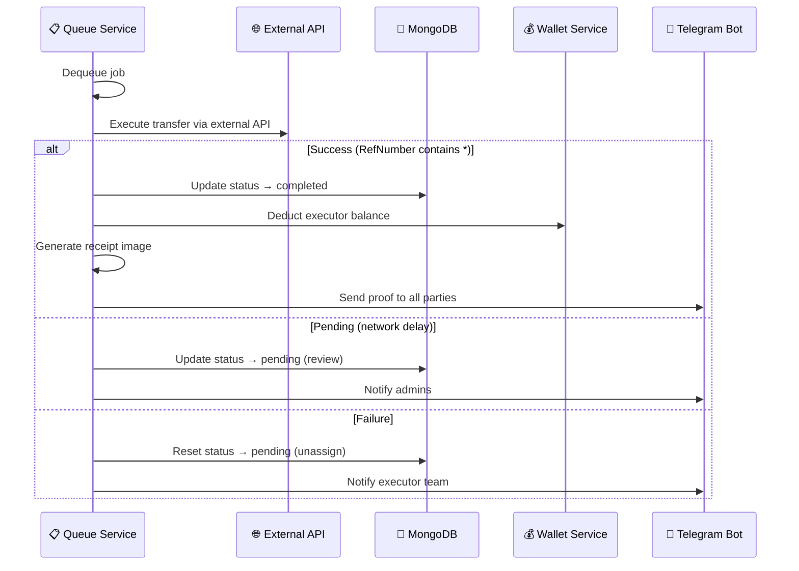

---

## Financial Engine (Double-Entry Ledger)

The system implements a **Double-Entry Bookkeeping** model. Every financial movement creates balanced debit and credit entries.

### Accounting Principles

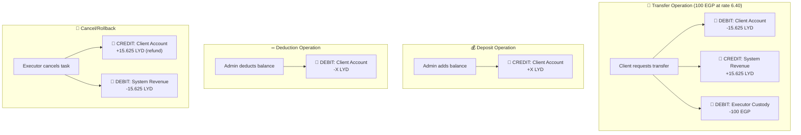

### Balance Calculation Formula

```
Client Balance = Initial Deposit
                 + Sum(Deposits)
                 - Sum(Transfer Costs in LYD)
                 - Sum(Deductions)
                 + Sum(Refunds from Cancelled Transfers)
```

### Ledger Entry Types

| Type | Direction | When |
|---|---|---|
| `DEPOSIT` | + (Credit) | Admin adds funds to client |
| `DEDUCTION` | - (Debit) | Admin deducts from client |
| `TRANSFER` | - (Debit) | Client creates transfer |
| `REFUND` | + (Credit) | Transfer cancelled, balance restored |
| `COMMISSION` | - (Debit) | System commission on operations |

### Atomicity Guarantees

1. **MongoDB Transactions**: All balance changes use `startSession()` + `startTransaction()`
2. **Atomic Updates**: `findOneAndUpdate` with balance check in the filter (`balance >= required`)
3. **Fallback Mode**: For standalone MongoDB (no replica set), uses atomic `findOneAndUpdate` without sessions
4. **Ledger Integrity**: Every `$inc` on balance creates a corresponding Ledger entry within the same session

---

## Authentication Architecture

### Dual Authentication System

```mermaid
graph TB
    subgraph WebAuth ["🌐 Web Authentication (Session-Based)"]
        W1["Browser Request"] -->|"POST /login"| W2["Express Session Middleware"]
        W2 -->|"Verify credentials<br/>(bcrypt.compare)"| W3["Create Session"]
        W3 -->|"Set-Cookie: sid=..."| W4["Session Store<br/>(MongoDB / Memory)"]
        W4 -->|"requireAuth middleware"| W5["Protected Routes"]
    end

    subgraph MobileAuth ["📱 Mobile Authentication (JWT)"]
        M1["Mobile App"] -->|"POST /api/mobile/login"| M2["Validate Credentials"]
        M2 -->|"jwt.sign()"| M3["Generate Tokens"]
        M3 -->|"accessToken (1h)<br/>refreshToken (30d)"| M1
        M1 -->|"Authorization: Bearer ..."| M4["authenticateJWT Middleware"]
        M4 -->|"jwt.verify()"| M5["req.user = decoded"]
        M5 --> M6["Protected Endpoints"]
    end

    subgraph BotAuth ["🤖 Telegram Bot Authentication"]
        B1["Telegram Message"] -->|"ctx.from.id"| B2["Lookup telegramId"]
        B2 -->|"Employee / User / Admin"| B3["Bot Command Handler"]
    end
```

### JWT Token Lifecycle

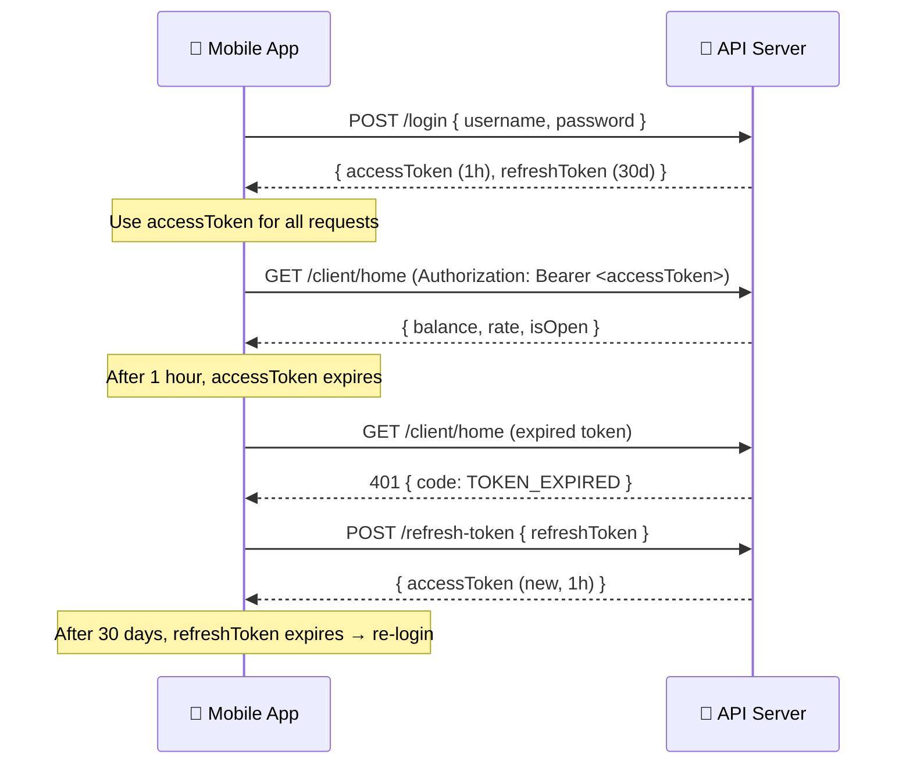

### Account Types & Login Priority

| Priority | Account Type | Model | Search Fields |
|---|---|---|---|
| 1 | Executor | `Employee` | `webUsername`, `phone` |
| 2 | Company Staff | `ClientEmployee` | `webUsername`, `phone` |
| 3 | Individual | `User` | `webUsername`, `phone` |

---

## Real-time Communication

### Socket.IO Architecture

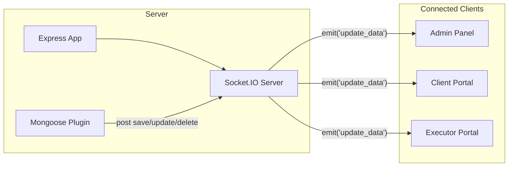

### Events

| Event | Direction | Description |
|---|---|---|
| `update_data` | Server → Client | Any data change in MongoDB |
| `connection` | Client → Server | New WebSocket connection |
| `disconnect` | Client → Server | Client disconnected |

---

## Technology Stack

| Layer | Technology | Version | Purpose |
|---|---|---|---|
| **Runtime** | Node.js | 18+ | Server-side JavaScript |
| **Framework** | Express.js | 5.x | HTTP routing & middleware |
| **Database** | MongoDB | 7+ | Document store (primary) |
| **Cache** | Redis | 7+ | Sessions, cache, rate limiting |
| **ODM** | Mongoose | 9.x | Schema validation & queries |
| **Auth (Web)** | express-session | 1.19 | Cookie-based sessions |
| **Auth (Mobile)** | jsonwebtoken | 9.x | Stateless JWT auth |
| **Real-time** | Socket.IO | 4.x | WebSocket events |
| **Bots** | Telegraf | 4.x | Telegram Bot API |
| **Security** | Helmet | 8.x | HTTP security headers |
| **Rate Limit** | express-rate-limit | 8.x | DDoS protection |
| **Validation** | express-validator | 7.x | Input sanitization |
| **Hashing** | bcryptjs | 3.x | Password hashing (12 rounds) |
| **Encryption** | crypto (AES-256-GCM) | native | Sensitive data encryption |
| **Reports** | ExcelJS | 4.x | Excel generation |
| **PDF** | Puppeteer | 24.x | Receipt rendering |
| **Logging** | Winston | 3.x | Structured JSON logging |
| **Metrics** | prom-client | 15.x | Prometheus metrics |
| **Testing** | Jest + Supertest | 29.x | Unit & integration tests |
| **CI/CD** | GitHub Actions | — | Automated pipeline |
| **Container** | Docker + Compose | — | Deployment |

---

## Deployment Architecture

### Production Topology

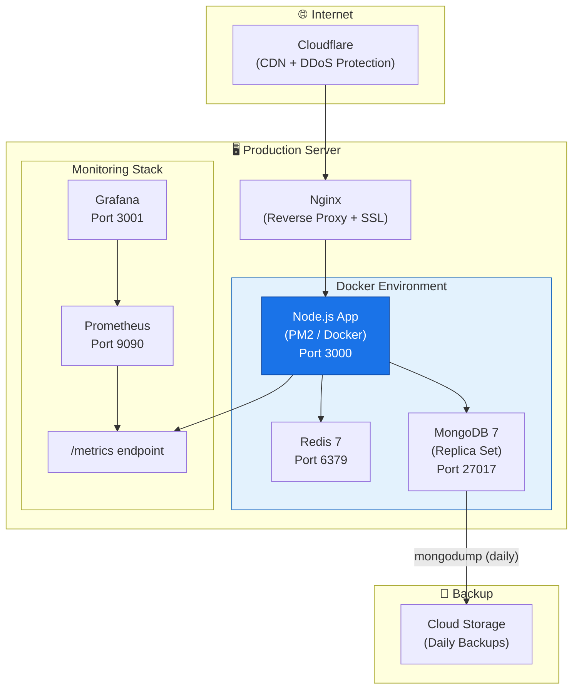

---

## Security Architecture

### Defense-in-Depth Model

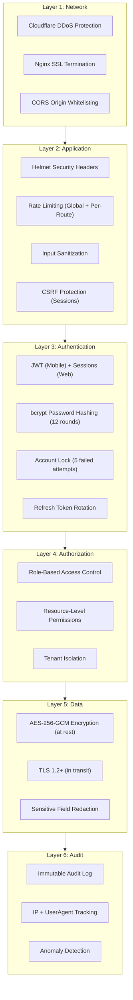

> 📖 For detailed security documentation, see [SECURITY.md](SECURITY.md)

---

## Scalability & Performance

### Current Architecture Limits

| Resource | Current Capacity | Bottleneck |
|---|---|---|
| **Concurrent Users** | ~500 | Single Node.js process |
| **Transfers/min** | ~1,000 | MongoDB write throughput |
| **WebSocket Connections** | ~10,000 | Socket.IO memory |

### Scaling Strategy

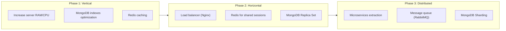

### Performance Optimization Checklist

- [x] Compound indexes on all frequent queries
- [x] Atomic `findOneAndUpdate` (no race conditions)
- [x] Mongoose `lean()` for read-only queries
- [x] Redis caching for settings and exchange rates
- [x] Connection pooling (Mongoose default: 100)
- [x] Rate limiting to prevent abuse
- [ ] Read replicas for reporting queries
- [ ] CDN for static assets

---

## Design Decisions & Trade-offs

### 1. Monolithic vs Microservices

**Decision**: Monolithic with modular internal architecture (Controllers → Services → Repositories).

**Rationale**:
- Simpler deployment and debugging for a financial system
- MongoDB transactions work best within a single process
- Modular design allows future extraction to microservices
- Team size (1-3 developers) favors monolith

### 2. MongoDB vs PostgreSQL

**Decision**: MongoDB (document store)

**Rationale**:
- Flexible schema for varying transaction types
- Native JSON for API responses
- Mongoose provides schema validation
- Double-entry ledger works well with document model
- **Trade-off**: No native JOIN support → denormalized data

### 3. JWT + Sessions (Dual Auth)

**Decision**: JWT for mobile, Sessions for web

**Rationale**:
- Mobile apps need stateless auth (JWT)
- Web portals benefit from server-side sessions (CSRF protection)
- Different security models for different attack surfaces

### 4. Single Instance for Financial Operations

**Decision**: `instances: 1` in PM2 config

**Rationale**:
- Financial atomicity requires single-writer
- MongoDB sessions + transactions handle concurrent requests
- Scaling via vertical scaling first, then distributed locking
- **Trade-off**: Single point of failure → mitigated by health checks + auto-restart

### 5. Telegram as Primary Notification Channel

**Decision**: Telegram bots for client/executor/admin communication

**Rationale**:
- Target market (Libya) has high Telegram adoption
- Real-time bidirectional communication
- File sharing (proof images) built-in
- No SMS costs

---

## Directory Structure

```
vodafone-cash-system/
├── app.js                        # Entry point + middleware + route mounting
├── config/
│   ├── database.js               # MongoDB connection
│   ├── redis.js                  # Redis connection + fallback
│   ├── swagger.js                # OpenAPI/Swagger configuration
│   └── env.js                    # Environment validation
├── controllers/                  # Request handlers (thin layer)
│   ├── auth/
│   │   └── authController.js
│   ├── client/
│   │   └── clientController.js
│   └── executor/
│       └── executorController.js
├── services/                     # Business logic
│   ├── authService.js            # Authentication & token management
│   ├── transferService.js        # Transfer creation, cancel, complete
│   ├── walletService.js          # Double-entry ledger operations
│   ├── auditService.js           # Audit trail management
│   ├── securityService.js        # IP tracking, anomaly detection
│   ├── queueService.js           # API transfer queue
│   ├── notificationService.js    # Telegram notifications
│   ├── settlementService.js      # Financial settlements
│   ├── reconciliationService.js  # Balance reconciliation
│   ├── cacheService.js           # Redis/memory caching
│   └── passwordService.js        # Password hashing & migration
├── repositories/                 # Data access layer
│   ├── userRepository.js
│   ├── transactionRepository.js
│   ├── ledgerRepository.js
│   └── settingsRepository.js
├── models/                       # 18+ Mongoose schemas
│   ├── Transaction.js
│   ├── Ledger.js
│   ├── User.js
│   ├── ClientBot.js
│   ├── ExecutorBot.js
│   ├── Employee.js
│   ├── ClientEmployee.js
│   ├── AuditLog.js
│   ├── Settings.js
│   ├── Settlement.js
│   ├── Reconciliation.js
│   ├── Tenant.js
│   └── ...
├── routes/                       # Express routers (thin routing)
│   ├── mobileApi.js
│   ├── clientPortal.js
│   ├── executorPortal.js
│   ├── botApi.js
│   ├── merchantApi.js
│   └── ...
├── middlewares/
│   ├── auth.js                   # Session authentication
│   ├── jwtAuth.js                # JWT authentication
│   ├── errorHandler.js           # Global error handler
│   ├── sanitize.js               # Input sanitization
│   ├── accountLock.js            # Account locking after failures
│   ├── requestLogger.js          # HTTP request logging
│   ├── metrics.js                # Prometheus metrics
│   └── tenantResolver.js         # Multi-tenant resolution
├── validators/                   # Input validation rules
│   └── mobileValidators.js
├── bots/                         # Telegram bots
│   ├── admin/
│   ├── client/
│   └── executor/
├── cron/                         # Scheduled tasks
│   └── closing.js
├── utils/                        # Utilities
│   ├── encryption.js             # AES-256-GCM
│   ├── logger.js                 # Winston logger
│   ├── helpers.js
│   └── rateHelper.js
├── monitoring/                   # Monitoring configs
│   ├── grafana-dashboard.json
│   └── docker-compose.monitoring.yml
├── tests/
│   ├── unit/
│   ├── integration/
│   ├── stress/
│   └── ...
├── docs/
│   ├── ARCHITECTURE.md           # (this file)
│   ├── API.md
│   ├── DATABASE.md
│   ├── SECURITY.md
│   └── DEPLOYMENT.md
├── .github/workflows/
│   └── ci-cd.yml
├── Dockerfile
├── docker-compose.yml
└── package.json
```
