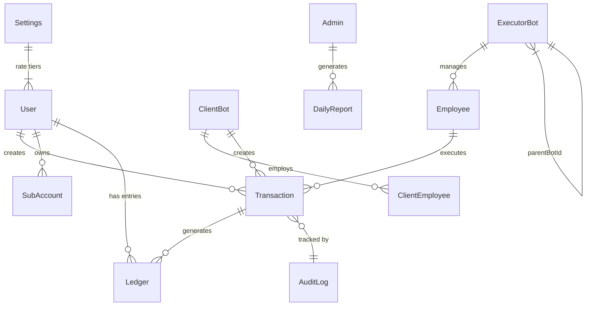

# 💾 Database Documentation — Al-Ahram Pay

## Overview

The system uses **MongoDB** (via Mongoose 9) with **18 collections** organized into 5 domains.

---

## Entity Relationship Diagram



---

## Collections Reference

### 🏦 Financial Domain

#### Transaction
> Core financial operation record — transfers, deposits, deductions.

| Field | Type | Required | Description |
|---|---|---|---|
| `customId` | String | ✅ | Human-readable ID (`ATT-YYMM-XXXX`) |
| `userId` | String | ✅ | Telegram ID of the client |
| `amount` | Number | ✅ | Amount in EGP |
| `costLYD` | Number | ✅ | Cost in LYD (amount / rate) |
| `exchangeRate` | Number | ✅ | Rate at time of creation |
| `finalRate` | Number | | Actual rate applied |
| `status` | String | ✅ | `pending`, `processing`, `accepted`, `completed`, `cancelled`, `deposit`, `deduction` |
| `transferType` | String | ✅ | `vodafone`, `orange`, `etisalat`, `we`, `post_account`, `post_card`, `card_sale` |
| `vodafoneNumber` | String | | Recipient wallet/account number |
| `accountNumber` | String | | Postal account number |
| `operatorId` | String | | Executor's telegram ID |
| `executorName` | String | | Name of executor |
| `executorBotId` | ObjectId | | Reference to ExecutorBot |
| `executorBotName` | String | | Bot name |
| `executorSenderPhone` | String | | Sender phone used by executor |
| `proofImage` | String | | Telegram file_id for receipt |
| `employeeName` | String | | Client name |
| `companyName` | String | | Company name (if company client) |
| `clientBotId` | ObjectId | | Reference to ClientBot |
| `notes` | String | | Additional notes |
| `cancelReason` | String | | Reason for cancellation |
| `emergencyAlert` | Date | | Emergency escalation timestamp |
| `isSubAccountTx` | Boolean | | Whether from sub-account |
| `subAccountId` | ObjectId | | SubAccount reference |
| `subAccountName` | String | | Sub-account name |
| `subClientRate` | Number | | Rate charged to sub-account |
| `subAccountCostLYD` | Number | | Cost charged to sub-account |
| `masterProfit` | Number | | Master's profit from sub-account |

**Indexes:**
- `{ customId: 1 }` — unique
- `{ status: 1, createdAt: -1 }`
- `{ userId: 1, createdAt: -1 }`
- `{ operatorId: 1, status: 1 }`
- `{ executorBotId: 1, status: 1 }`
- `{ clientBotId: 1, status: 1, createdAt: -1 }`

---

#### Ledger
> Double-entry bookkeeping record for every financial movement.

| Field | Type | Required | Description |
|---|---|---|---|
| `referenceId` | ObjectId | ✅ | Reference to Transaction |
| `userId` | String | ✅ | Telegram ID |
| `type` | String | ✅ | `deposit`, `deduction`, `transfer_debit`, `transfer_credit`, `refund`, `card_sale` |
| `amount` | Number | ✅ | Amount in LYD |
| `balanceBefore` | Number | ✅ | Balance before operation |
| `balanceAfter` | Number | ✅ | Balance after operation |
| `description` | String | | Human-readable description |

**Indexes:**
- `{ referenceId: 1 }` — unique
- `{ userId: 1, createdAt: -1 }`

---

#### Counter
> Auto-incrementing sequence generator for customId.

| Field | Type | Description |
|---|---|---|
| `name` | String | Counter identifier (e.g., `transaction_seq`) |
| `value` | Number | Current sequence value |

---

### 👥 User Domain

#### User
> Individual client account.

| Field | Type | Required | Description |
|---|---|---|---|
| `telegramId` | String | ✅ | Unique Telegram user ID |
| `name` | String | ✅ | Full name |
| `phone` | String | | Phone number |
| `balance` | Number | | Current LYD balance (default: 0) |
| `tier` | Number | | Rate tier (1, 2, or 3) |
| `creditLimit` | Number | | Allowed negative balance |
| `status` | String | | `active`, `suspended`, `banned` |
| `role` | String | | `owner`, `accountant` |
| `webUsername` | String | | Web portal login |
| `webPassword` | String | | Hashed password |
| `refreshToken` | String | | Mobile app refresh token |
| `telegramLinkToken` | String | | One-time linking token |
| `clientBotId` | ObjectId | | Associated ClientBot |

**Indexes:**
- `{ telegramId: 1 }` — unique

---

#### ClientBot
> Company/organization client with associated employees.

| Field | Type | Required | Description |
|---|---|---|---|
| `name` | String | ✅ | Company name |
| `balance` | Number | | LYD balance |
| `tier` | Number | | Rate tier |
| `creditLimit` | Number | | Credit limit |
| `status` | String | | `active`, `suspended` |
| `token` | String | | Telegram bot token |

---

#### ClientEmployee
> Staff member of a company client (can create transfers on behalf of company).

| Field | Type | Required | Description |
|---|---|---|---|
| `telegramId` | String | ✅ | Telegram ID |
| `name` | String | ✅ | Employee name |
| `clientBotId` | ObjectId | ✅ | Parent company |
| `role` | String | | `employee`, `manager` |
| `webUsername` | String | | Web login |
| `webPassword` | String | | Hashed password |
| `refreshToken` | String | | Mobile refresh token |

---

#### SubAccount
> Point-of-sale sub-account under a master User.

| Field | Type | Required | Description |
|---|---|---|---|
| `masterType` | String | ✅ | `user` or `company` |
| `masterId` | ObjectId | ✅ | Parent User/Company ID |
| `name` | String | ✅ | Sub-account name |
| `webUsername` | String | ✅ | Unique login |
| `webPassword` | String | ✅ | Hashed password |
| `customMargin` | Number | | Extra margin on rate |
| `balance` | Number | | Virtual balance |
| `creditLimit` | Number | | Credit limit |
| `status` | String | | `active`, `suspended` |

---

### 👷 Executor Domain

#### ExecutorBot
> Telegram bot assigned to an execution team.

| Field | Type | Description |
|---|---|---|
| `name` | String | Bot display name |
| `token` | String | Telegram bot token |
| `status` | String | `active`, `inactive`, `paused` |
| `balance` | Number | Custody balance (EGP) |
| `isManagerBot` | Boolean | Whether this is a manager bot |
| `parentBotId` | ObjectId | Parent bot (hierarchy) |
| `isApiBot` | Boolean | Whether this connects to external API |
| `apiUrl` | String | External API endpoint |
| `apiToken` | String | External API authentication |

---

#### Employee
> Human executor who accepts and completes transfers.

| Field | Type | Required | Description |
|---|---|---|---|
| `telegramId` | String | ✅ | Telegram ID |
| `name` | String | ✅ | Employee name |
| `botId` | ObjectId | ✅ | Associated ExecutorBot |
| `role` | String | | `operator`, `manager` |
| `status` | String | | `pending`, `active`, `suspended`, `banned` |
| `webUsername` | String | | Web portal login |
| `webPassword` | String | | Hashed password |

**Indexes:**
- `{ telegramId: 1, botId: 1 }` — unique compound

---

### 🔒 Security & Admin Domain

#### AuditLog
> Immutable audit trail for all sensitive operations.

| Field | Type | Description |
|---|---|---|
| `action` | String | Event type (see enum below) |
| `performedBy` | ObjectId | Who performed the action |
| `performedByModel` | String | `Employee`, `ClientEmployee`, `User`, `Admin`, `System` |
| `performedByName` | String | Snapshot of performer name |
| `targetId` | ObjectId | Affected entity |
| `targetModel` | String | Affected model name |
| `ipAddress` | String | Client IP |
| `userAgent` | String | Browser/device info |
| `endpoint` | String | API path called |
| `oldData` | Mixed | State before change |
| `newData` | Mixed | State after change |
| `metadata` | Mixed | Additional context |
| `success` | Boolean | Whether operation succeeded |
| `errorCode` | String | Error code if failed |

**Action Enum:** `LOGIN_SUCCESS`, `LOGIN_FAILED`, `LOGOUT`, `TOKEN_REFRESH`, `TRANSFER_CREATED`, `TRANSFER_CANCELLED`, `TRANSFER_COMPLETED`, `DEPOSIT_CREATED`, `DEDUCTION_CREATED`, `BALANCE_ADJUSTED`, `TASK_ACCEPTED`, `ADMIN_ACTION`, `SETTINGS_CHANGED`, `USER_CREATED`, `USER_UPDATED`, `USER_BANNED`, `ROLE_CHANGED`, `ACCOUNT_LOCKED`, `ACCOUNT_UNLOCKED`, `PASSWORD_CHANGED`, `API_KEY_ROTATED`, `SYSTEM_STARTUP`, `SYSTEM_SHUTDOWN`

**Severity Levels:** `info`, `warning`, `critical`

**Indexes:**
- `{ action: 1, createdAt: -1 }`
- `{ performedBy: 1, createdAt: -1 }`
- `{ targetId: 1, createdAt: -1 }`
- `{ ipAddress: 1, createdAt: -1 }`
- `{ createdAt: -1 }`
- `{ deviceFingerprint: 1, createdAt: -1 }`
- `{ severity: 1, createdAt: -1 }`

---

#### Admin
> System administrator account.

| Field | Type | Description |
|---|---|---|
| `telegramId` | String | Telegram ID (sparse unique) |
| `name` | String | Display name |
| `role` | String | `admin`, `master` |
| `webUsername` | String | Web login (sparse unique) |
| `webPassword` | String | Hashed password |

---

#### Settings
> Global system configuration (singleton document).

| Field | Type | Description |
|---|---|---|
| `rateLevel1` | Number | Exchange rate for tier 1 |
| `rateLevel2` | Number | Exchange rate for tier 2 |
| `rateLevel3` | Number | Exchange rate for tier 3 |
| `isManualClosed` | Boolean | Manual system closure |
| `openingTime` | String | Auto-open time (HH:MM) |
| `closingTime` | String | Auto-close time (HH:MM) |
| `autoRouteEnabled` | Boolean | Auto-route transfers |
| `autoRouteBotId` | ObjectId | Default executor bot |

---

#### DailyReport
> Stored Excel report snapshots for daily closing.

| Field | Type | Description |
|---|---|---|
| `dateString` | String | Report date (YYYY-MM-DD) |
| `reportType` | String | Report type identifier |
| `fileName` | String | Generated file name |
| `fileData` | Buffer | Excel file binary |
| `generatedBy` | String | Admin name |

---

### 💰 Settlement & Reconciliation Domain

#### Settlement
> Financial settlement records for periodic accounting.

| Field | Type | Required | Description |
|---|---|---|---|
| `period.start` | Date | ✅ | Settlement period start |
| `period.end` | Date | ✅ | Settlement period end |
| `type` | String | ✅ | `daily`, `weekly`, `monthly`, `custom` |
| `entityType` | String | ✅ | `executor`, `client_user`, `client_company`, `system` |
| `entityId` | ObjectId | | Entity reference |
| `entityName` | String | | Entity display name |
| `summary.totalTransactions` | Number | | Total transaction count |
| `summary.totalAmountEGP` | Number | | Total in EGP |
| `summary.totalCostLYD` | Number | | Total cost in LYD |
| `summary.totalRefunds` | Number | | Total refunded |
| `summary.netAmount` | Number | | Net settlement amount |
| `status` | String | | `draft`, `pending_approval`, `approved`, `paid`, `disputed` |
| `approvedBy` | ObjectId | | Admin who approved |
| `approvedAt` | Date | | Approval timestamp |
| `tenantId` | ObjectId | | Multi-tenant reference |

**Indexes:**
- `{ 'period.start': 1, 'period.end': 1 }`
- `{ entityType: 1, entityId: 1, 'period.start': -1 }`
- `{ status: 1, createdAt: -1 }`

---

#### Reconciliation
> Automated balance reconciliation records.

| Field | Type | Required | Description |
|---|---|---|---|
| `reconciliationDate` | Date | ✅ | Date of reconciliation |
| `type` | String | ✅ | `daily`, `weekly`, `monthly`, `manual` |
| `status` | String | | `pending`, `matched`, `discrepancy_found`, `resolved` |
| `summary.totalEntitiesChecked` | Number | | Entities checked |
| `summary.matchedCount` | Number | | Matching entities |
| `summary.discrepancyCount` | Number | | Discrepancies found |
| `summary.totalLedgerSum` | Number | | Sum from ledger |
| `summary.totalAccountBalance` | Number | | Sum from accounts |
| `summary.difference` | Number | | Total difference |
| `discrepancies` | Array | | List of discrepancy details |
| `checks.ledgerIntegrity` | Boolean | | All transactions have ledger entries |
| `checks.orphanedTransactions` | Number | | Transactions without ledger |
| `checks.orphanedLedgerEntries` | Number | | Ledger without transactions |

**Indexes:**
- `{ reconciliationDate: -1 }`
- `{ status: 1, reconciliationDate: -1 }`

---

### 🏢 Multi-Tenant Domain

#### Tenant
> Organization/tenant for multi-tenant support.

| Field | Type | Required | Description |
|---|---|---|---|
| `name` | String | ✅ | Organization name |
| `slug` | String | ✅ | URL-friendly identifier (unique) |
| `status` | String | | `active`, `suspended`, `trial`, `inactive` |
| `branding` | Object | | Logo, colors, display name |
| `rates` | Object | | Custom exchange rates per level |
| `features` | Object | | Enabled features (API, bots, portal) |
| `limits` | Object | | Usage limits (amounts, users, executors) |
| `subscription.plan` | String | | `trial`, `standard`, `premium`, `enterprise` |
| `apiKey` | String | | Unique API key for external access |

**Indexes:**
- `{ slug: 1 }` — unique
- `{ apiKey: 1 }` — sparse unique

---

## Data Integrity Rules

1. **Atomic Balance Updates**: All balance changes use `findOneAndUpdate` with MongoDB sessions
2. **Ledger Consistency**: Every balance change creates a corresponding Ledger entry
3. **Immutable Audit Log**: AuditLog records are never modified or deleted
4. **Cascade Prevention**: Soft-delete (status change) instead of hard-delete for financial records
5. **Unique Constraints**: `telegramId` for users, `customId` for transactions
6. **Idempotency**: Transfer creation uses `idempotencyKey` to prevent duplicate operations

---

## Index Performance Analysis

### Compound Indexes Strategy

| Collection | Index | Query Pattern | Frequency |
|---|---|---|---|
| Transaction | `{ status, createdAt: -1 }` | Filter by status + sort by date | Very High |
| Transaction | `{ userId, createdAt: -1 }` | Client's transaction history | High |
| Transaction | `{ executorBotId, status }` | Executor's active tasks | High |
| Transaction | `{ clientBotId, createdAt: -1 }` | Company transactions | Medium |
| Ledger | `{ entityId, createdAt: -1 }` | Account statements | High |
| Ledger | `{ entityId, type, createdAt: -1 }` | Filtered statements | Medium |
| Ledger | `{ transactionId }` | Lookup by transaction | Medium |
| AuditLog | `{ action, createdAt: -1 }` | Security reports | Medium |
| AuditLog | `{ ipAddress, createdAt: -1 }` | IP investigation | Low |

### Index Recommendations

- All `createdAt: -1` suffixes enable efficient time-range queries
- Sparse indexes on optional unique fields (e.g., `webUsername`) save space
- TTL indexes can be added to AuditLog for auto-cleanup after retention period

---

## Migration Strategy

### Schema Changes

Since MongoDB is schemaless, most changes are additive:

1. **Adding fields**: New fields get `default` values; existing documents remain valid
2. **Renaming fields**: Use migration script with `$rename` operator
3. **Removing fields**: Use `$unset` operator in migration script
4. **Index changes**: Create new indexes in background; drop old ones after verification

### Migration Script Pattern

```javascript
// migrations/YYYY-MM-DD-description.js
module.exports = {
    up: async (db) => {
        await db.collection('auditlogs').updateMany(
            { severity: { $exists: false } },
            { $set: { severity: 'info' } }
        );
    },
    down: async (db) => {
        await db.collection('auditlogs').updateMany(
            {},
            { $unset: { severity: 1 } }
        );
    }
};
```

---

## Backup & Recovery Procedures

### Automated Backup

```bash
# Daily backup at 2:00 AM (Africa/Tripoli timezone)
0 2 * * * mongodump --uri="$MONGO_URI" --gzip --out=/backups/$(date +\%Y-\%m-\%d)
```

### Recovery

```bash
# Restore from backup
mongorestore --uri="$MONGO_URI" --gzip /backups/2026-06-01/

# Point-in-time recovery (requires oplog)
mongorestore --uri="$MONGO_URI" --oplogReplay --oplogLimit="<timestamp>"
```

### Backup Validation

```bash
# Verify backup integrity
mongorestore --dryRun --uri="$MONGO_URI" --gzip /backups/latest/
```

---

## Data Retention Policy

| Collection | Retention | Rationale |
|---|---|---|
| **Transaction** | Permanent | Financial records (legal requirement) |
| **Ledger** | Permanent | Accounting trail (legal requirement) |
| **AuditLog** | 2 years | Security compliance |
| **DailyReport** | 1 year | Can be regenerated |
| **Session** | 24 hours | TTL auto-delete |
| **Settlement** | 5 years | Accounting compliance |
| **Reconciliation** | 2 years | Operational |

### Implementing TTL Auto-Delete

```javascript
// For sessions (auto-expire after 24 hours)
sessionSchema.index({ createdAt: 1 }, { expireAfterSeconds: 86400 });

// For old audit logs (optional — after 2 years)
// auditLogSchema.index({ createdAt: 1 }, { expireAfterSeconds: 63072000 });
```

