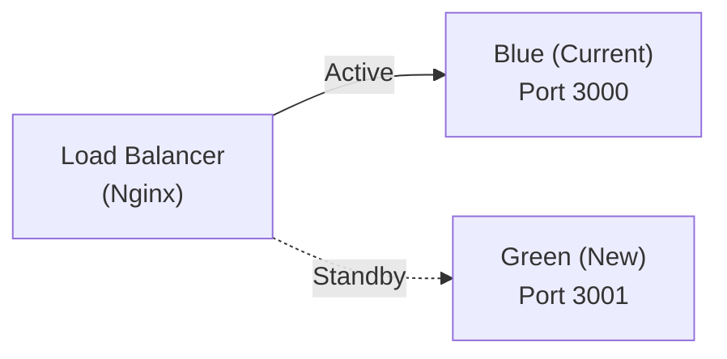

# 🚀 Deployment Guide — Al-Ahram Pay

## Prerequisites

| Requirement | Minimum | Recommended |
|---|---|---|
| **Node.js** | 18.x | 20.x LTS |
| **MongoDB** | 7.0 | 7.0+ (Atlas or self-hosted) |
| **RAM** | 512 MB | 2 GB |
| **Disk** | 1 GB | 10 GB (for logs & reports) |
| **OS** | Ubuntu 20.04 / Windows 10 | Ubuntu 22.04 |

---

## Environment Variables

Copy `.env.example` to `.env` and configure:

| Variable | Required | Description | Example |
|---|---|---|---|
| `MONGO_URI` | ✅ | MongoDB connection string | `mongodb://127.0.0.1:27017/vodafone_cash` |
| `CLIENT_BOT_TOKEN` | ✅ | Telegram client bot token | `123456:ABC-DEF...` |
| `ADMIN_BOT_TOKEN` | ✅ | Telegram admin bot token | `654321:XYZ-ABC...` |
| `ADMIN_TELEGRAM_ID` | ✅ | Admin's Telegram user ID | `987654321` |
| `ADMIN_SECRET_CODE` | ✅ | Code for adding new admins | `any-secret-string` |
| `JWT_SECRET` | ✅ | JWT signing key (≥32 chars) | `crypto.randomBytes(64).toString('hex')` |
| `JWT_REFRESH_SECRET` | ✅ | Refresh token key (≥32 chars) | `crypto.randomBytes(64).toString('hex')` |
| `SESSION_SECRET` | ✅ | Session encryption key | `crypto.randomBytes(64).toString('hex')` |
| `PANEL_USER` | ✅ | Admin panel username | `admin` |
| `PANEL_PASS` | ✅ | Admin panel password | `StrongP@ss!2026` |
| `PORT` | | Server port | `3000` |
| `NODE_ENV` | | Environment | `production` |
| `ALLOWED_ORIGINS` | | CORS whitelist (comma-separated) | `https://pay.example.com` |

### Generate Secure Keys

```bash
# Generate all secrets at once
node -e "const c=require('crypto'); console.log('JWT_SECRET='+c.randomBytes(64).toString('hex')); console.log('JWT_REFRESH_SECRET='+c.randomBytes(64).toString('hex')); console.log('SESSION_SECRET='+c.randomBytes(64).toString('hex'));"
```

---

## Deployment Options

### Option 1: Direct Node.js (PM2)

```bash
# 1. Install PM2 globally
npm install -g pm2

# 2. Install dependencies (production only)
npm ci --only=production

# 3. Start with PM2
pm2 start ecosystem.config.js

# 4. Save PM2 process list & enable startup
pm2 save
pm2 startup
```

**ecosystem.config.js** (included in project):
```javascript
module.exports = {
    apps: [{
        name: 'ahram-pay',
        script: 'app.js',
        instances: 1,          // Single instance (financial atomicity)
        exec_mode: 'fork',
        env_production: {
            NODE_ENV: 'production',
            PORT: 3000
        }
    }]
};
```

> ⚠️ **Important**: Use `instances: 1` for financial systems. Multi-instance requires distributed locking.

### Option 2: Docker

```bash
# Build and run
docker-compose up -d

# View logs
docker-compose logs -f app

# Restart
docker-compose restart app
```

**docker-compose.yml** (included):
```yaml
services:
  app:
    build: .
    ports:
      - "3000:3000"
    env_file: .env
    depends_on:
      - mongo
    restart: always

  mongo:
    image: mongo:7
    volumes:
      - mongo_data:/data/db
    restart: always

volumes:
  mongo_data:
```

### Option 3: Cloud Deployment

#### MongoDB Atlas
1. Create cluster at [cloud.mongodb.com](https://cloud.mongodb.com)
2. Whitelist your server IP
3. Copy connection string to `MONGO_URI`

#### Railway / Render / DigitalOcean App Platform
1. Connect GitHub repository
2. Set environment variables in dashboard
3. Deploy command: `npm ci --only=production && node app.js`

---

## Nginx Reverse Proxy (Recommended)

```nginx
server {
    listen 80;
    server_name pay.example.com;
    return 301 https://$server_name$request_uri;
}

server {
    listen 443 ssl http2;
    server_name pay.example.com;

    ssl_certificate /etc/letsencrypt/live/pay.example.com/fullchain.pem;
    ssl_certificate_key /etc/letsencrypt/live/pay.example.com/privkey.pem;

    # Security headers
    add_header X-Frame-Options SAMEORIGIN;
    add_header X-Content-Type-Options nosniff;

    location / {
        proxy_pass http://127.0.0.1:3000;
        proxy_http_version 1.1;
        proxy_set_header Upgrade $http_upgrade;
        proxy_set_header Connection 'upgrade';
        proxy_set_header Host $host;
        proxy_set_header X-Real-IP $remote_addr;
        proxy_set_header X-Forwarded-For $proxy_add_x_forwarded_for;
        proxy_set_header X-Forwarded-Proto $scheme;
        proxy_cache_bypass $http_upgrade;
    }
}
```

---

## Health Checks

| Endpoint | Method | Description | Expected |
|---|---|---|---|
| `GET /health` | GET | Basic liveness | `{ status: 'ok' }` |
| `GET /health/ready` | GET | DB connectivity | `{ status: 'ok', db: 'connected' }` |

---

## Backup Strategy

### MongoDB Backup

```bash
# Daily backup (add to crontab)
mongodump --uri="$MONGO_URI" --out=/backups/$(date +%Y-%m-%d)

# Restore from backup
mongorestore --uri="$MONGO_URI" /backups/2026-06-03/
```

### Automated Backup Crontab

```bash
# Daily at 2:00 AM
0 2 * * * mongodump --uri="mongodb://localhost:27017/vodafone_cash" --out=/backups/$(date +\%Y-\%m-\%d) --gzip 2>&1 | logger -t mongodb-backup

# Keep last 30 days only
0 3 * * * find /backups -type d -mtime +30 -exec rm -rf {} +
```

---

## Monitoring & Observability

### Log Files

| Log | Location | Content |
|---|---|---|
| Application | `logs/combined.log` | All structured JSON logs |
| Errors | `logs/error.log` | Error-level events only |
| Console | stdout (PM2/Docker) | Colorized development output |

### Prometheus Metrics

The app exposes a `/metrics` endpoint in Prometheus format:

```bash
# Test metrics endpoint
curl http://localhost:3000/metrics
```

**Available Metrics:**
| Metric | Type | Description |
|---|---|---|
| `http_requests_total` | Counter | Total HTTP requests by method/path/status |
| `http_request_duration_ms_avg` | Summary | Average response time per endpoint |
| `active_transfers_count` | Gauge | Currently active transfers |
| `login_successes_total` | Counter | Total successful logins |
| `login_failures_total` | Counter | Total failed logins |
| `transfers_created_total` | Counter | Total transfers created |
| `transfers_completed_total` | Counter | Total transfers completed |
| `errors_total` | Counter | Total server errors |
| `process_memory_rss_bytes` | Gauge | Process memory usage |
| `process_uptime_seconds` | Gauge | Process uptime |

### Grafana Dashboard Setup

```bash
# Start the monitoring stack
cd monitoring
docker-compose -f docker-compose.monitoring.yml up -d

# Access:
# Prometheus: http://localhost:9090
# Grafana:    http://localhost:3001 (admin/ahram2026)
```

A pre-configured dashboard is available at `monitoring/grafana-dashboard.json`.

### Health Check Endpoints

```bash
# Basic health
GET /health → { "status": "ok", "uptime": 12345, "version": "2.0.0" }

# Readiness (checks DB)
GET /health/ready → { "status": "ok", "db": "connected" }
```

### Key Metrics to Monitor (Thresholds)

| Metric | Warning | Critical | Action |
|---|---|---|---|
| Response time (p95) | > 500ms | > 2000ms | Scale up / investigate |
| Error rate | > 1% | > 5% | Check logs / rollback |
| Memory (RSS) | > 512MB | > 1GB | Restart / memory leak |
| Login failures/min | > 10 | > 50 | Check for brute force |
| Active transfers | > 100 | > 500 | Check queue health |

---

## Blue-Green Deployment

### Strategy



### Steps

```bash
# 1. Deploy new version to Green
docker build -t ahram-api:v2.1 .
docker run -d --name ahram-green -p 3001:3000 ahram-api:v2.1

# 2. Health check Green
curl http://localhost:3001/health/ready
# Should return { "status": "ok" }

# 3. Switch traffic (update Nginx)
# In nginx.conf: upstream ahram { server 127.0.0.1:3001; }
nginx -s reload

# 4. Verify traffic on Green
curl http://your-domain.com/health

# 5. Stop Blue (after verification)
docker stop ahram-blue
docker rename ahram-blue ahram-blue-old
docker rename ahram-green ahram-blue
```

---

## Rollback Procedures

### Quick Rollback (< 5 minutes)

```bash
# If Green (new) is failing:
# 1. Switch Nginx back to Blue (old)
nginx -s reload

# 2. Stop Green
docker stop ahram-green

# 3. Investigate logs
docker logs ahram-green 2>&1 | tail -100
```

### Database Rollback

```bash
# If schema migration caused issues:
# 1. Restore from latest backup
mongorestore --uri="$MONGO_URI" --gzip /backups/latest/

# 2. Restart old version
docker start ahram-blue-old
```

### Rollback Checklist

- [ ] Switch load balancer to previous version
- [ ] Verify health checks pass on rolled-back version
- [ ] Check financial integrity: run reconciliation
- [ ] Notify team and document incident
- [ ] Create post-mortem report

---

## Capacity Planning

### Current Capacity (Single Instance)

| Resource | Capacity | Monitoring |
|---|---|---|
| Concurrent Users | ~500 | `active_transfers_count` metric |
| Transfers/minute | ~1,000 | `transfers_created_total` rate |
| WebSocket Connections | ~10,000 | Socket.IO memory |
| Database Size | ~50 GB | MongoDB stats |

### Scaling Triggers

| Trigger | Threshold | Action |
|---|---|---|
| CPU > 80% sustained | 5 minutes | Vertical scale (more cores) |
| Memory > 1GB | 5 minutes | Investigate + increase limit |
| Response time > 1s | p95 | Add Redis caching / optimize queries |
| Transfers > 500/min | 30 minutes | Consider horizontal scaling |
| DB size > 50GB | — | Add MongoDB replica / sharding |

---

## Troubleshooting

| Issue | Cause | Solution |
|---|---|---|
| `ECONNREFUSED` on start | MongoDB not running | Start MongoDB: `mongod` |
| `JWT_SECRET too short` | Secret < 32 chars | Generate proper secret (see above) |
| Bot not responding | Invalid token | Check `*_BOT_TOKEN` in .env |
| `ENOMEM` | Memory limit | Increase container/server RAM |
| Session lost on restart | MemoryStore in production | Set `NODE_ENV=production` for MongoStore |
| Slow queries | Missing indexes | Run `db.collection.getIndexes()` and verify |
| High memory usage | Mongoose connection pool | Check `poolSize` option |
| WebSocket disconnects | Nginx timeout | Set `proxy_read_timeout 86400s` |
| Redis connection failed | Redis not available | System falls back to in-memory cache automatically |

