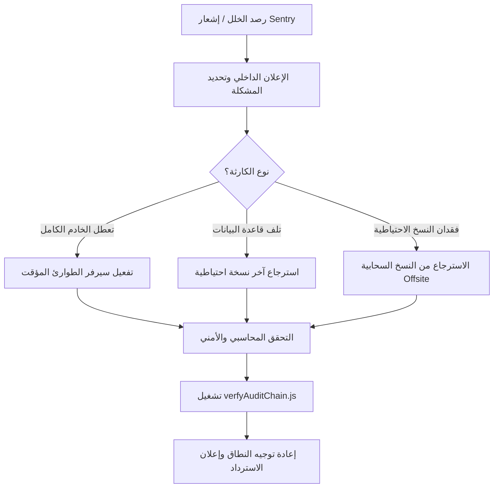

# 🌪️ خطة التعافي من الكوارث (Disaster Recovery Plan)

> **النظام**: Al-Ahram Pay | **الإصدار**: 2.0 | **تاريخ النشر**: 2026-06-08 | **السرية**: سرّي للغاية

تم إعداد هذا الدليل لمواجهة أسوأ السيناريوهات الطارئة التي قد تؤدي إلى توقف الكيان المالي أو فقدان جزء من بنيته التحتية. يهدف هذا المستند إلى تقليل وقت التوقف عن العمل (Downtime) والحد من الخسائر المالية إلى الصفر تقريباً.

---

## 📞 بروتوكول الاستجابة الفورية للمخاطر (Incident Response Flow)

عند الكشف عن خلل جسيم أو توقف مفاجئ للخدمة، يتم اتباع الخطوات التالية فوراً:



---

## 1. سيناريو تعطل الخادم بالكامل (Complete Server Loss)

في حال حدوث خلل مادي في العتاد أو فقدان الوصول الكامل للمزود السحابي:

### أ. تهيئة خادم جديد
1. قم بإنشاء بيئة جديدة فوراً (Ubuntu 22.04 LTS موصى به).
2. قم بتثبيت المكونات الأساسية للنظام:
   ```bash
   sudo apt update && sudo apt upgrade -y
   sudo apt install docker.io docker-compose git -y
   sudo systemctl enable --now docker
   ```

### ب. سحب الكود وتهيئة البيئة
1. قم بسحب مستودع المشروع الرئيسي:
   ```bash
   git clone git@github.com:al-ahram/vodafone-cash-system.git /usr/src/app
   cd /usr/src/app
   ```
2. استرجع ملف البيئة `.env` من مخزن المفاتيح السري والآمن (Secret Manager):
   ```bash
   nano .env
   # أدخل المتغيرات المطلوبة وتأكد من MONGO_URI و SENTRY_DSN
   ```

### ج. تشغيل النظام عبر الحاويات
```bash
# تشغيل خادم التطبيق وقاعدة البيانات في الخلفية
docker compose -f docker-compose.prod.yml up -d --build
```

### د. تحديث إعدادات DNS والنطاق
قم بالدخول إلى لوحة تحكم Cloudflare / DNS وقم بتغيير توجيه النطاق `pay.example.com` إلى عنوان الـ IP الجديد للخادم الاحتياطي.

---

## 2. سيناريو تلف قاعدة البيانات (Database Corruption / Data Loss)

في حال حدوث تلاعب غير مصرح به أو تلف بنيوي في الجداول المالية:

### أ. عزل السيرفر فوراً لمنع تفاقم الخلل
أوقف العمليات النشطة فوراً حتى لا يتم تعديل الأرصدة أثناء الاسترجاع:
```bash
docker compose -f docker-compose.prod.yml stop app
```

### ب. تنظيف الجداول التالفة
قم بالدخول إلى MongoDB وحذف قاعدة البيانات المصابة بالكامل لضمان عدم تداخل البيانات التالفة مع النسخة النظيفة:
```bash
docker compose -f docker-compose.prod.yml exec mongo mongosh "mongodb://localhost:27017/vodafone_cash" --eval "db.dropDatabase()"
```

### ج. استرجاع أحدث نسخة احتياطية سليمة
1. استعرض قائمة النسخ الاحتياطية المتاحة وحدد أحدث نسخة تم التحقق من سلامتها:
   ```bash
   ls -la /backups/
   ```
2. استورد البيانات باستخدام `mongorestore` مع تمكين ميزة الضغط لضمان سرعة الاستيراد:
   ```bash
   docker compose -f docker-compose.prod.yml exec -T mongo mongorestore --archive=/backups/2026-06-08_02-00-00.archive.gz --gzip
   ```

### د. التحقق من سلامة الأرصدة محاسبياً وسلسلة الكتل (Cryptographic Audit Trail)
شغل أداة التحقق للتأكد من عدم وجود أي فجوات أو تلاعب في البيانات التي تم استردادها:
```bash
docker compose -f docker-compose.prod.yml exec app node scripts/verifyAuditChain.js
```

---

## 3. سيناريو فقدان النسخ الاحتياطية المحلية (Local Backup Loss)

في حال تعرض الخادم لبرمجيات الفدية (Ransomware) أو تلف الأقراص المخصصة للنسخ الاحتياطي بالكامل:

### أ. سياسة التخزين السحابي البعيد (Offsite S3 Backups)
تلتزم إدارة Al-Ahram Pay بنسخ كافة ملفات قاعدة البيانات والصور يومياً إلى مزود سحابي معزول (مثل AWS S3 أو Backblaze B2) بتخزين غير قابل للتعديل (Immutable Object Storage) لمنع الحذف أو التشفير.

### ب. خطوات الاسترجاع السحابي
1. قم بتحميل أداة `aws-cli` أو أداة الاتصال بالسحابة:
   ```bash
   pip install awscli
   ```
2. تهيئة الاتصال السحابي بالصلاحيات المشفرة:
   ```bash
   aws configure
   ```
3. سحب آخر نسخة احتياطية من الخزانة البعيدة (S3 Bucket):
   ```bash
   aws s3 cp s3://al-ahram-backups/database/db_latest.archive.gz /backups/db_latest.archive.gz
   aws s3 cp s3://al-ahram-backups/uploads/uploads_latest.tar.gz /backups/uploads_latest.tar.gz
   ```
4. فك تشفير وفحص سلامة الملفات ثم اتبع إجراءات استعادة قاعدة البيانات المبينة أعلاه.

---

## 📋 قائمة فحص ما بعد الاستعادة (Post-Recovery Checklist)

لا تقم بإعادة تشغيل المنظومة للعملاء والمنفذين إلا بعد التحقق بنجاح من البنود التالية بالكامل:

- [ ] **الاتصال بقاعدة البيانات**: فحص جاهزية الخادم وحالة الاتصال:
  ```bash
  curl http://localhost:3000/health/ready
  # المتوقع: { "status": "ok", "db": "connected" }
  ```
- [ ] **اختبار سلسلة التدقيق المشفرة**: تشغيل السكربت بنجاح:
  ```bash
  node scripts/verifyAuditChain.js
  # المتوقع: نجاح الفحص وسلسلة سجلات التدقيق سليمة تماماً
  ```
- [ ] **فحص رصيد البوتات والمنفذين**: التأكد من مطابقة أرصدة مجموعات المنفذين مع شبكة فودافون كاش الفعلية.
- [ ] **تفعيل جدار الحماية والأمان**: التأكد من عمل SSL وميدلوير تحديد المستأجرين (Multi-Tenancy) بالكامل.
- [ ] **تصفير طوابير المعالجة (إذا لزم الأمر)**: إذا كان هناك مهام معلقة قديمة متراكمة في BullMQ نتيجة التوقف الطويل، تأكد من تنظيفها أو مراجعتها يدوياً لتجنب إرسال حوالات قديمة مكررة بشكل عشوائي للعملاء.
