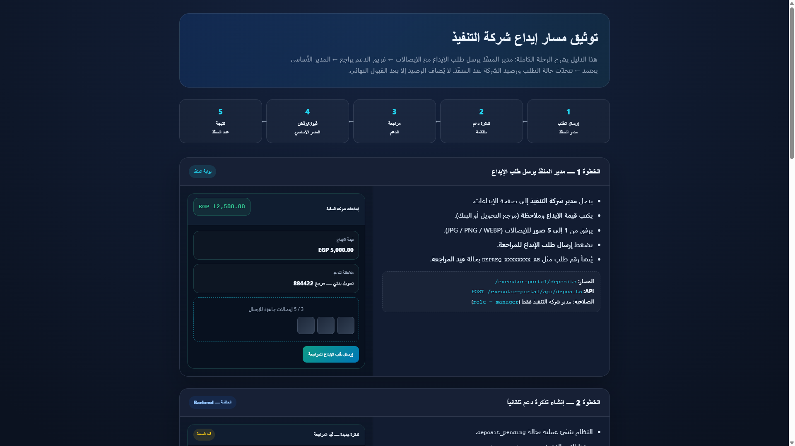
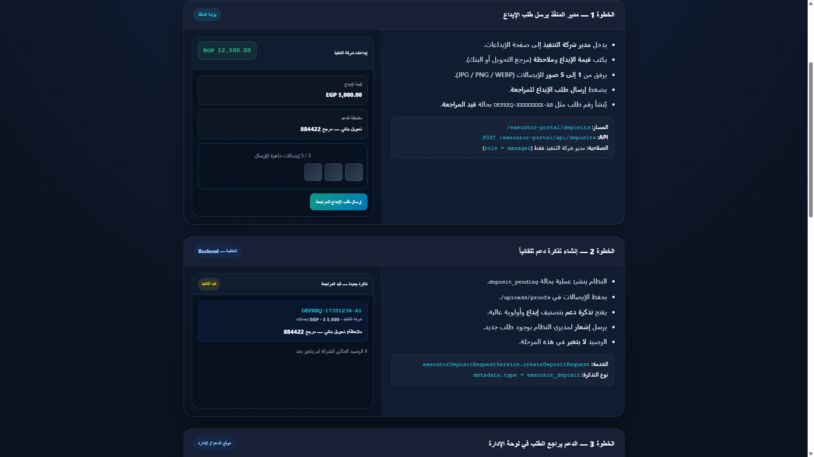
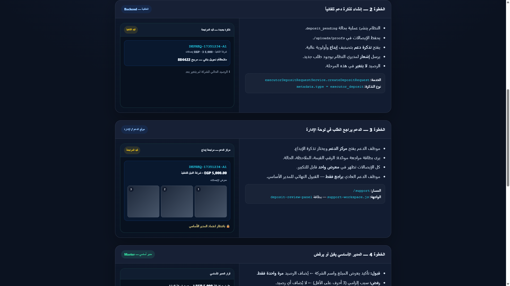
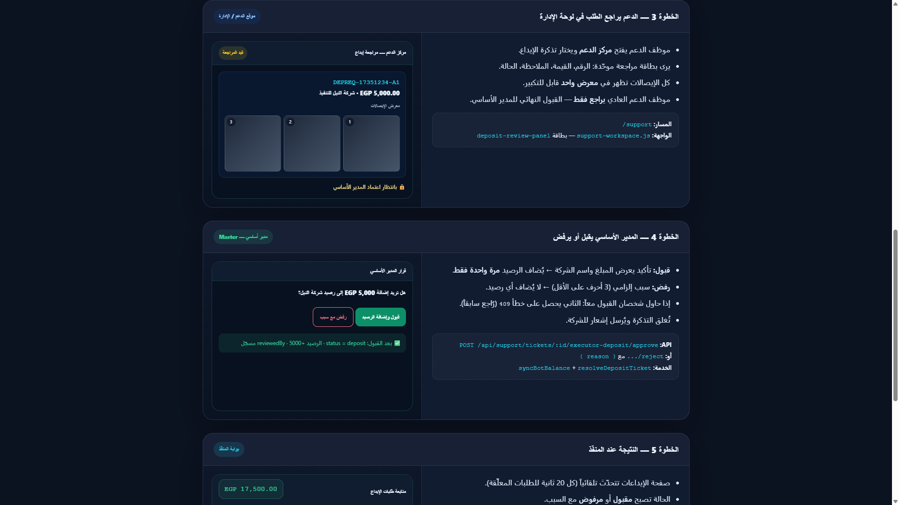
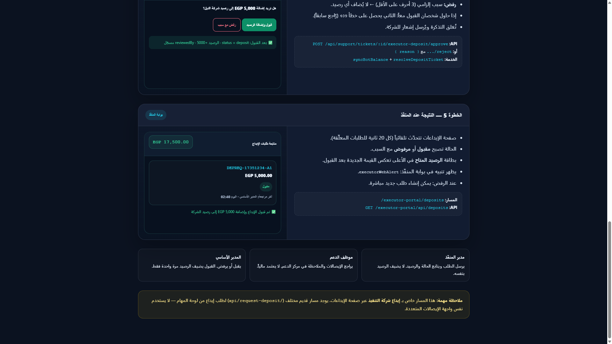

# توثيق مسار إيداع شركة التنفيذ

## نظرة عامة

| # | المرحلة | من ينفّذ | أين |
|---|---------|----------|-----|
| 1 | إرسال طلب الإيداع + الإيصالات | مدير المنفّذ | `/executor-portal/deposits` |
| 2 | إنشاء تذكرة دعم تلقائياً | النظام | Backend |
| 3 | مراجعة الإيصالات | موظف الدعم | `/support` |
| 4 | قبول أو رفض | المدير الأساسي | `/support` |
| 5 | ظهور النتيجة والرصيد | مدير المنفّذ | `/executor-portal/deposits` |

> **مهم:** الرصيد لا يُضاف إلا في الخطوة 4 عند **القبول** — مرة واحدة فقط.

---

## الصور التوثيقية

### الخطوة 1 — إرسال الطلب (مدير المنفّذ)

- قيمة + ملاحظة + 1–5 صور إيصال
- API: `POST /executor-portal/api/deposits`
- الحالة: **قيد المراجعة** (`deposit_pending`)

### الخطوة 2 — تذكرة دعم تلقائية

- حفظ الإيصالات في `uploads/proofs/`
- فتح تذكرة `executor_deposit` + إشعار للإدارة
- **الرصيد لا يتغير**

### الخطوة 3 — مراجعة الدعم

- بطاقة مراجعة + معرض إيصالات موحّد
- موظف الدعم يراجع فقط — لا يعتمد مالياً

### الخطوة 4 — قبول / رفض (المدير الأساسي)

- **قبول:** `POST .../executor-deposit/approve` → `syncBotBalance`
- **رفض:** سبب إلزامي → `POST .../executor-deposit/reject`

### الخطوة 5 — النتيجة عند المنفّذ

- الحالة: **مقبول** أو **مرفوض**
- الرصيد يتحدّث في بطاقة الأعلى
- تحديث تلقائي كل 20 ثانية للطلبات المعلّقة

---

## دليل تفاعلي

افتح في المتصفح:

`design-previews/executor-deposit-flow-guide.html`

---

## الأدوار

| الدور | الصلاحية |
|-------|----------|
| مدير المنفّذ | إرسال ومتابعة — لا يضيف الرصيد بنفسه |
| موظف الدعم | مراجعة الإيصالات والملاحظة |
| المدير الأساسي | قبول أو رفض — يضيف الرصيد مرة واحدة |
