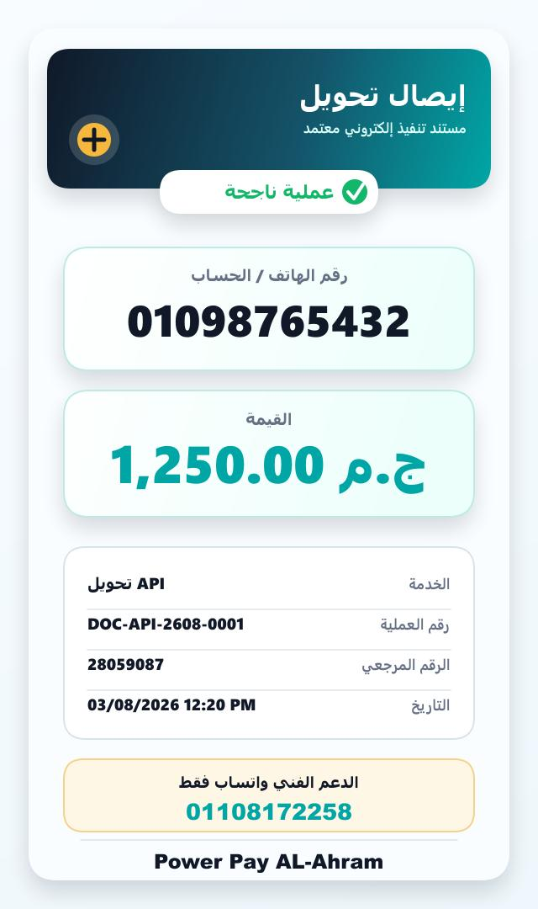
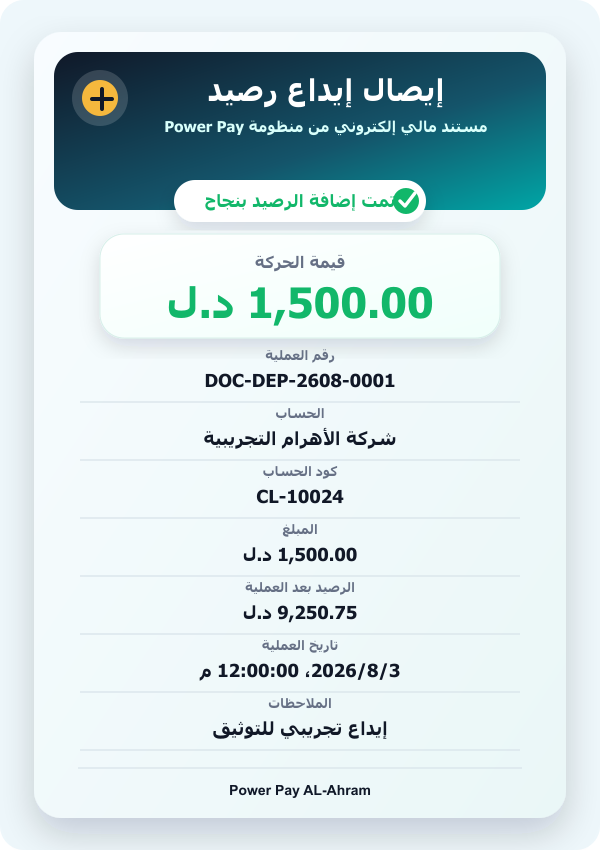
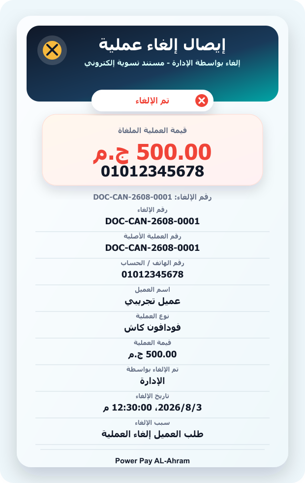
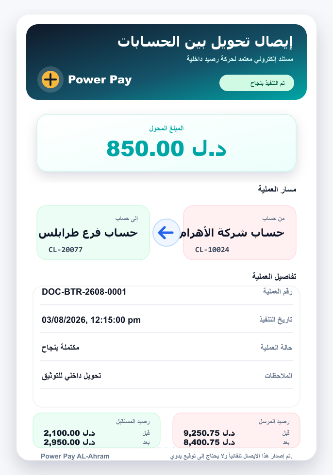

# توثيق الهوية البصرية للإيصالات

## نطاق التحديث

تم تحديث إيصالات المنظومة إلى تصميم موحد ملون وثلاثي الأبعاد مع الحفاظ على أبعاد كل إيصال داخل النظام.

الهوية الجديدة تستخدم:

- كحلي عميق للخلفيات الرئيسية.
- تركواز للحالات الناجحة والقيم الأساسية.
- ذهبي كعلامة بصرية مميزة.
- أحمر واضح لإيصالات الإلغاء.
- بطاقات داخلية وظلال ناعمة لإحساس احترافي ثلاثي الأبعاد.

## ضوابط البيانات

- لا يتم عرض سعر التكلفة أو `costLYD` داخل الإيصالات المرئية.
- يتم الحفاظ على بيانات العملية الأساسية مثل رقم العملية، الرقم المرجعي، رقم الهاتف أو الحساب، القيمة، التاريخ، الحالة، والملاحظات عند توفرها.
- إيصال الإلغاء يعرض قيمة العملية الأصلية فقط ولا يعرض تكلفة الإرجاع.

## صور التوثيق

### إيصال تحويل



### إيصال إيداع



### إيصال إلغاء



### إيصال تحويل داخلي



## طريقة إعادة توليد الصور

```powershell
node scripts\generateReceiptPreviews.js
```
