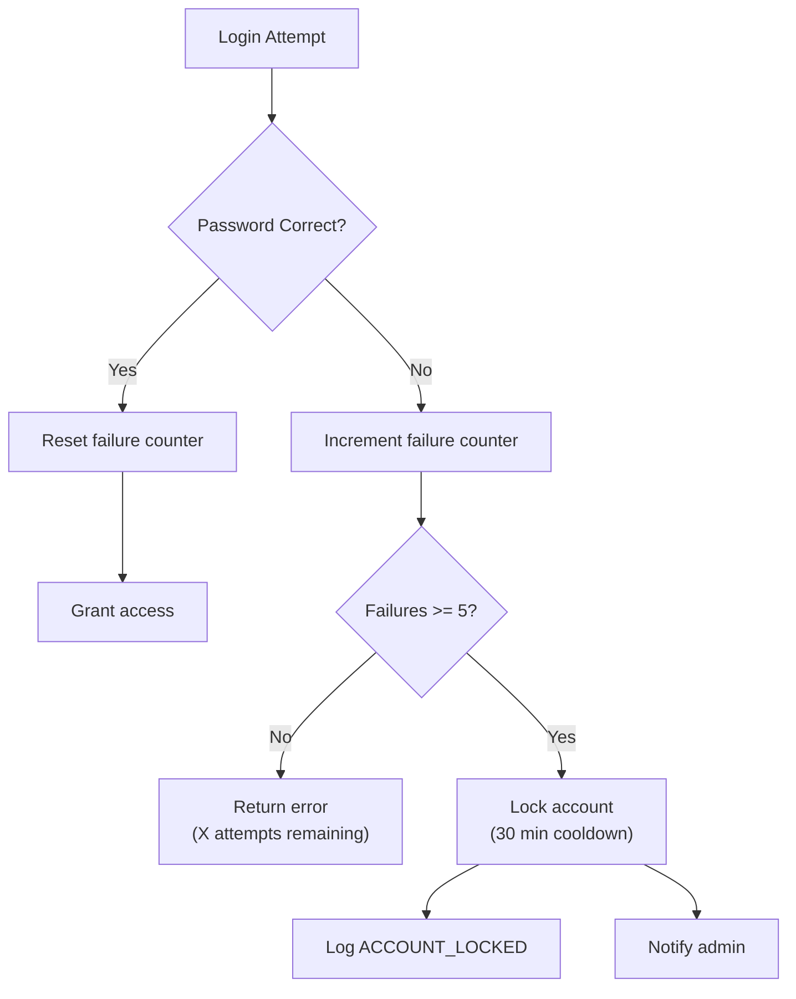
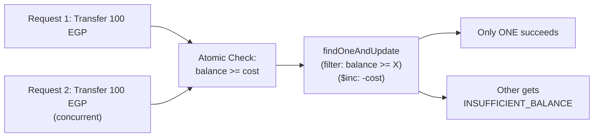
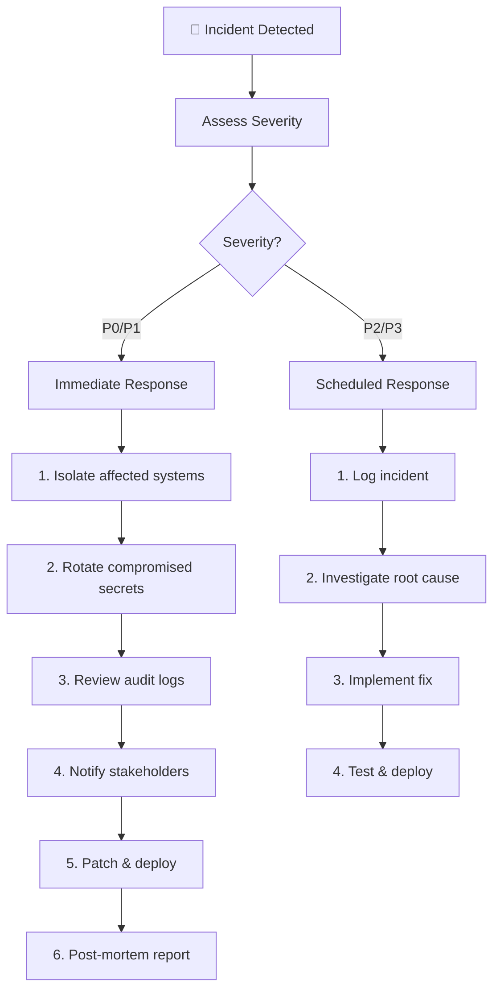

# 🔒 Security Documentation — Al-Ahram Pay

> **Version**: 2.0 | **Last Updated**: 2026-06-04 | **Classification**: CONFIDENTIAL

---

## Table of Contents

1. [Security Overview](#security-overview)
2. [Threat Model](#threat-model)
3. [Authentication & Authorization](#authentication--authorization)
4. [Password Security](#password-security)
5. [HTTP Security Headers](#http-security-headers-helmet)
6. [Rate Limiting](#rate-limiting)
7. [Input Validation & Sanitization](#input-validation--sanitization)
8. [Data Encryption](#data-encryption)
9. [Audit Trail](#audit-trail)
10. [Account Security](#account-security)
11. [CORS Policy](#cors-policy)
12. [Financial Transaction Security](#financial-transaction-security)
13. [OWASP Top 10 Compliance](#owasp-top-10-compliance)
14. [Incident Response Plan](#incident-response-plan)
15. [Security Testing](#security-testing)
16. [Compliance Checklist](#compliance-checklist)
17. [Dependency Security](#dependency-security)

---

## Security Overview

Al-Ahram Pay implements **defense-in-depth** security with 6 layers of protection for financial data and operations. As a FinTech system handling monetary transfers between Egypt and Libya, security is the **top priority**.

### Security Principles

| Principle | Implementation |
|---|---|
| **Least Privilege** | Role-based access with minimum required permissions |
| **Defense in Depth** | 6 security layers (network → audit) |
| **Fail Secure** | System defaults to denying access on errors |
| **Separation of Duties** | Client, executor, admin have distinct permissions |
| **Audit Everything** | Immutable audit log for all sensitive operations |
| **Encrypt Sensitive Data** | AES-256-GCM at rest, TLS in transit |

---

## Threat Model

### Threat Landscape

```mermaid
graph TB
    subgraph Threats ["🎯 Threat Vectors"]
        T1["Brute Force Login"]
        T2["NoSQL Injection"]
        T3["XSS (Cross-Site Scripting)"]
        T4["CSRF Attacks"]
        T5["JWT Token Theft"]
        T6["DDoS"]
        T7["Unauthorized Access"]
        T8["Data Tampering"]
        T9["Insider Threat"]
        T10["Man-in-the-Middle"]
        T11["Session Hijacking"]
        T12["Race Condition<br/>(Double Spend)"]
    end

    subgraph Mitigations ["🛡️ Mitigations"]
        M1["Rate Limiting<br/>(8 login/15min)<br/>+ Account Lock"]
        M2["Input Sanitization<br/>(express-validator)<br/>+ escapeRegex"]
        M3["Helmet CSP<br/>+ Output Encoding"]
        M4["SameSite Cookies<br/>+ httpOnly + secure"]
        M5["Short Expiry (1h)<br/>+ Refresh Rotation<br/>+ Token Binding"]
        M6["Global Rate Limit<br/>(2000 req/5min)<br/>+ Cloudflare"]
        M7["JWT + Session Auth<br/>+ RBAC<br/>+ Tenant Isolation"]
        M8["Audit Log<br/>+ Ledger Integrity<br/>+ Atomic Transactions"]
        M9["Audit Trail<br/>+ IP Tracking<br/>+ Anomaly Detection"]
        M10["HSTS + TLS 1.2+<br/>+ Certificate Pinning"]
        M11["httpOnly Cookies<br/>+ Session Rotation<br/>+ MongoStore TTL"]
        M12["MongoDB Sessions<br/>+ Atomic findOneAndUpdate<br/>+ Balance Check in Filter"]
    end

    T1 --> M1
    T2 --> M2
    T3 --> M3
    T4 --> M4
    T5 --> M5
    T6 --> M6
    T7 --> M7
    T8 --> M8
    T9 --> M9
    T10 --> M10
    T11 --> M11
    T12 --> M12
```



### Risk Assessment Matrix

| Threat | Likelihood | Impact | Risk Level | Mitigation Status |
|---|---|---|---|---|
| Brute Force Login | High | Medium | 🔴 High | ✅ Mitigated (rate limit + lock) |
| NoSQL Injection | Medium | Critical | 🔴 High | ✅ Mitigated (escapeRegex + validator) |
| XSS | Medium | High | 🟠 Medium | ✅ Mitigated (Helmet CSP) |
| CSRF | Low | High | 🟡 Low | ✅ Mitigated (SameSite cookies) |
| JWT Token Theft | Medium | Critical | 🔴 High | ✅ Mitigated (short expiry + rotation) |
| DDoS | High | High | 🔴 High | ✅ Mitigated (rate limit + Cloudflare) |
| Double Spend (Race) | Low | Critical | 🟠 Medium | ✅ Mitigated (atomic transactions) |
| Data Tampering | Low | Critical | 🟠 Medium | ✅ Mitigated (audit log + ledger) |
| Insider Threat | Low | Critical | 🟠 Medium | ✅ Mitigated (audit + RBAC) |

---

## Authentication & Authorization

### Web Authentication (Session-Based)

| Property | Value |
|---|---|
| **Method** | Express Session + Cookie |
| **Storage** | MongoDB (production) / Memory (development) |
| **Cookie Flags** | `httpOnly: true`, `secure: true` (production), `maxAge: 24h` |
| **Session Secret** | Environment variable (`SESSION_SECRET`) — min 32 chars |
| **SameSite** | `Lax` (default) |

### Mobile Authentication (JWT)

| Property | Value |
|---|---|
| **Method** | JWT (Access + Refresh) |
| **Algorithm** | HS256 |
| **Access Token Expiry** | 1 hour |
| **Refresh Token Expiry** | 30 days |
| **Secret Length** | Enforced ≥ 32 characters at startup (process.exit if violated) |
| **Token Rotation** | Refresh token updated on each refresh |
| **Token Binding** | Token includes userId, accountType, telegramId |
| **Revocation** | Refresh token stored in DB; cleared on logout |

### Authorization Levels (RBAC)

| Role | Access Level | Routes | Can Transfer? |
|---|---|---|---|
| **master** | Full system access | All admin routes | N/A |
| **admin** | Admin panel (limited) | Dashboard, transactions, reports | N/A |
| **client_user** | Client portal + Mobile API | `/client/*`, `/api/mobile/client/*` | ✅ |
| **client_company** | Company portal | `/client/*` (via company balance) | ✅ |
| **executor** | Executor portal + Mobile API | `/executor-portal/*`, `/api/mobile/executor/*` | ❌ |
| **accountant** | Read-only financial view | `/client/dashboard` (no transfers) | ❌ |

### Startup Security Checks

```javascript
// jwtAuth.js — Server refuses to start with weak secrets
if (!process.env.JWT_SECRET || process.env.JWT_SECRET.length < 32) {
    console.error('🚨 [FATAL] JWT_SECRET is missing or too short');
    process.exit(1);
}
```

---

## Password Security

| Policy | Implementation |
|---|---|
| **Hashing** | bcryptjs with salt rounds = 12 |
| **Comparison** | Constant-time via `bcrypt.compare()` |
| **Migration** | Legacy plaintext passwords auto-hashed on first login |
| **Storage** | Only hashed passwords stored (`$2b$12$...`) |
| **Validation** | Minimum 8 characters enforced via express-validator |
| **Rotation** | Users can change via web portal / admin |

### Password Auto-Migration (Legacy Support)

```javascript
// If password doesn't start with '$2', it's legacy plaintext
if (doc.webPassword && !doc.webPassword.startsWith('$2')) {
    // Hash and update atomically
    await Model.updateOne(
        { _id: doc._id },
        { webPassword: await bcrypt.hash(password, 12) }
    );
}
```

---

## HTTP Security Headers (Helmet)

### Configuration

```javascript
app.use(helmet({
    contentSecurityPolicy: {
        directives: {
            defaultSrc: ["'self'"],
            scriptSrc: ["'self'", "'unsafe-inline'", "cdn.jsdelivr.net", "cdnjs.cloudflare.com"],
            styleSrc: ["'self'", "'unsafe-inline'", "cdn.jsdelivr.net", "cdnjs.cloudflare.com", "fonts.googleapis.com"],
            fontSrc: ["'self'", "fonts.gstatic.com", "cdnjs.cloudflare.com"],
            imgSrc: ["'self'", "data:", "blob:", "*.telegram.org", "assets.mixkit.co"],
            connectSrc: ["'self'", "wss:", "ws:"],
            mediaSrc: ["'self'", "assets.mixkit.co"],
            frameSrc: ["'none'"],
        }
    },
    crossOriginEmbedderPolicy: false,
    hsts: { maxAge: 31536000, includeSubDomains: true, preload: true },
    referrerPolicy: { policy: 'strict-origin-when-cross-origin' },
    permissionsPolicy: {
        features: { camera: ["'none'"], microphone: ["'none'"], geolocation: ["'none'"] }
    }
}));
```

### Active Security Headers

| Header | Value | Purpose |
|---|---|---|
| `X-Content-Type-Options` | `nosniff` | Prevent MIME sniffing |
| `X-Frame-Options` | `SAMEORIGIN` | Prevent clickjacking |
| `X-XSS-Protection` | `0` | Deprecated; CSP handles this |
| `Strict-Transport-Security` | `max-age=31536000; includeSubDomains; preload` | Force HTTPS |
| `Content-Security-Policy` | (see above) | Prevent XSS/injection |
| `Referrer-Policy` | `strict-origin-when-cross-origin` | Control referrer info |
| `Permissions-Policy` | camera, microphone, geolocation disabled | Limit browser APIs |
| `X-DNS-Prefetch-Control` | `off` | Prevent DNS prefetching |
| `X-Download-Options` | `noopen` | IE download protection |

---

## Rate Limiting

| Endpoint | Window | Max Requests | Action | Purpose |
|---|---|---|---|---|
| **Global** | 5 minutes | 2,000 | Block with 429 | DDoS protection |
| **Login (Web)** | 1 minute | 10 | Block with 429 | Brute force prevention |
| **Login (Mobile)** | 15 minutes | 8 | Block with 429 + audit log | Brute force prevention |
| **Transfer** | 1 minute | 15 | Block with 429 | Abuse prevention |
| **Mobile API (General)** | 1 minute | 60 | Block with 429 | API abuse |
| **Account Lock** | 30 minutes | 5 failures | Lock account + audit log | Credential stuffing |

### Rate Limit Response Format

```json
{
    "success": false,
    "code": "TOO_MANY_REQUESTS",
    "message": "عدد كبير من محاولات الدخول، يرجى الانتظار 15 دقيقة"
}
```

---

## Input Validation & Sanitization

### Validators (`validators/mobileValidators.js`)

| Validator | Fields | Rules |
|---|---|---|
| `loginValidator` | username, password | trim, notEmpty, minLength(3), escape |
| `transferValidator` | amount, number, transferType | isFloat(min:1), trim, isIn |
| `cancelTaskValidator` | reason | trim, notEmpty, maxLength(500) |
| `completeTaskValidator` | senderPhone | optional, trim |
| `refreshTokenValidator` | refreshToken | trim, notEmpty |

### Sanitization Middleware (`middlewares/sanitize.js`)

| Function | Purpose |
|---|---|
| `escapeRegex()` | Prevents NoSQL injection via regex patterns in `$regex` queries |
| Input trimming | Removes leading/trailing whitespace |
| HTML entity encoding | Prevents stored XSS |

### File Upload Validation

```javascript
const upload = multer({
    storage: multer.memoryStorage(),
    limits: { fileSize: 5 * 1024 * 1024 },  // 5MB max
    fileFilter: (req, file, cb) => {
        const allowed = ['image/jpeg', 'image/png', 'image/webp', 'image/gif'];
        cb(null, allowed.includes(file.mimetype));
    }
});
```

---

## Data Encryption

### Encryption at Rest

| Data | Algorithm | Key Management |
|---|---|---|
| Passwords | bcrypt (12 rounds) | Salt auto-generated |
| Bot Tokens (`ExecutorBot.token`) | AES-256-GCM | ENCRYPTION_KEY env var |
| API Keys (`ExecutorBot.apiToken`) | AES-256-GCM | Derived from JWT_SECRET fallback |
| Refresh Tokens | AES-256-GCM | Encrypted before storage |
| Telegram Link Tokens | AES-256-GCM | Short-lived, auto-expire |

### AES-256-GCM Implementation

```javascript
// Format: iv:encrypted:tag (all hex encoded)
// IV: 16 bytes (128 bits) — random per encryption
// Tag: 16 bytes (128 bits) — authentication tag
// Key: 32 bytes (256 bits) — from ENCRYPTION_KEY or SHA-256(JWT_SECRET)

encrypt("bot_token_123")  → "a1b2c3...:d4e5f6...:g7h8i9..."
decrypt("a1b2c3...:d4e5f6...:g7h8i9...")  → "bot_token_123"
isEncrypted("a1b2c3...:d4e5f6...:g7h8i9...")  → true
```

### Encryption in Transit

| Channel | Protocol | Details |
|---|---|---|
| Web/API | HTTPS (TLS 1.2+) | Enforced via HSTS |
| WebSocket | WSS | Socket.IO over TLS |
| Telegram API | TLS 1.2+ | Enforced by Telegram |
| MongoDB | TLS | Optional (Atlas enforces) |

### Sensitive Data Redaction

Audit log sanitization removes sensitive fields before logging:

```javascript
const sensitiveFields = ['password', 'webPassword', 'refreshToken', 'token', 'secret'];
// All sensitive fields are replaced with '[REDACTED]' in audit logs
```

---

## Audit Trail

### Events Logged

| Event | When | Data Captured | Severity |
|---|---|---|---|
| `LOGIN_SUCCESS` | Successful auth | userId, IP, userAgent, accountType | Info |
| `LOGIN_FAILED` | Failed auth | username, IP, errorCode | Warning |
| `LOGOUT` | User logout | userId | Info |
| `TOKEN_REFRESH` | Token renewed | userId, success/fail | Info |
| `TRANSFER_CREATED` | New transfer | txId, amount, sender, recipient, rate | Info |
| `TRANSFER_COMPLETED` | Transfer executed | txId, executor, proof | Info |
| `TRANSFER_CANCELLED` | Transfer refunded | txId, reason, refund amount | Warning |
| `DEPOSIT_CREATED` | Balance deposit | userId, amount | Info |
| `DEDUCTION_CREATED` | Balance deduction | userId, amount, reason | Warning |
| `BALANCE_ADJUSTED` | Manual balance change | old/new balance, admin | Critical |
| `SETTINGS_CHANGED` | System settings | old/new values | Critical |
| `USER_CREATED` | New user | userId, name | Info |
| `USER_UPDATED` | Profile modified | changed fields | Info |
| `USER_BANNED` | Account suspended | userId, reason | Critical |
| `TASK_ACCEPTED` | Executor accepts | txId, executorId | Info |
| `ADMIN_ACTION` | Admin operation | action details | Warning |
| `ROLE_CHANGED` | Role modification | old/new role, admin | Critical |
| `ACCOUNT_LOCKED` | Auto-lock after failures | userId, attempt count, IP | Critical |
| `ACCOUNT_UNLOCKED` | Manual unlock | userId, admin | Warning |
| `PASSWORD_CHANGED` | Password update | userId | Warning |
| `API_KEY_ROTATED` | API key rotation | botId | Warning |

### Audit Log Properties

| Property | Description |
|---|---|
| **Immutable** | Records cannot be modified or deleted |
| **IP Tracking** | Client IP recorded for all operations |
| **User Agent** | Browser/device info captured |
| **Device Fingerprint** | Device-level identification |
| **Session ID** | Links related operations |
| **Indexed** | Optimized queries by action, performer, target, IP, and date |
| **Tamper-Proof** | No delete/update operations exposed |

### Anomaly Detection

The security service monitors for suspicious patterns:

| Pattern | Threshold | Action |
|---|---|---|
| Failed logins (same user) | 5 in 30 min | Account lock |
| Failed logins (same IP) | 20 in 30 min | IP temporary block |
| Rapid transfers | 10 in 1 min | Rate limit + alert |
| Unusual transfer amount | > 2x average | Admin alert |
| Login from new device | New userAgent | Notification |

---

## Account Security

### Account Locking



### Session Security

| Feature | Value |
|---|---|
| `httpOnly` | `true` — prevents JavaScript access |
| `secure` | `true` in production — HTTPS only |
| `maxAge` | 24 hours |
| `SameSite` | `Lax` — CSRF protection |
| Store | MongoDB (production) for persistence |

---

## Financial Transaction Security

### Preventing Double Spend



### Idempotency

```
Header: Idempotency-Key: <unique-uuid>
```

If the same `Idempotency-Key` is sent twice, the second request returns the original result without re-processing.

### Financial Integrity Checks

1. **Atomic Balance Update**: `findOneAndUpdate` with `{ balance: { $gte: required } }` in filter
2. **Ledger = Source of Truth**: Every balance change creates a Ledger entry
3. **Reconciliation**: Daily automated comparison of Ledger totals vs account balances
4. **Settlement**: Periodic settlement reports for all entities

---

## OWASP Top 10 Compliance

| # | Vulnerability | Status | Implementation |
|---|---|---|---|
| A01 | Broken Access Control | ✅ Mitigated | RBAC, JWT validation, tenant isolation |
| A02 | Cryptographic Failures | ✅ Mitigated | AES-256-GCM, bcrypt-12, TLS enforced |
| A03 | Injection | ✅ Mitigated | express-validator, escapeRegex, parameterized queries |
| A04 | Insecure Design | ✅ Mitigated | Threat modeling, atomic transactions, fail-secure |
| A05 | Security Misconfiguration | ✅ Mitigated | Helmet, env validation, startup checks |
| A06 | Vulnerable Components | ✅ Mitigated | npm audit in CI/CD, regular updates |
| A07 | Auth Failures | ✅ Mitigated | Account lock, rate limit, token rotation |
| A08 | Software Integrity | ✅ Mitigated | npm ci (lockfile), Docker digest |
| A09 | Logging Failures | ✅ Mitigated | Winston structured logging, audit trail |
| A10 | SSRF | ✅ Mitigated | URL validation for external API calls |

---

## Incident Response Plan

### Severity Levels

| Level | Description | Response Time | Example |
|---|---|---|---|
| **P0 — Critical** | Financial data breach, system compromise | < 15 min | Unauthorized fund transfer |
| **P1 — High** | Authentication bypass, data leak | < 1 hour | JWT secret exposed |
| **P2 — Medium** | DDoS, brute force attack | < 4 hours | Rate limit overwhelmed |
| **P3 — Low** | Minor vulnerability, info disclosure | < 24 hours | Verbose error messages |

### Response Workflow



### Emergency Procedures

| Action | Command |
|---|---|
| **Rotate JWT Secret** | Update `JWT_SECRET` in .env → restart app |
| **Lock All Accounts** | Set `isManualClosed: true` in Settings |
| **Block IP** | Add to Cloudflare/Nginx block list |
| **Force All Logout** | Clear all sessions in MongoDB |
| **Review Audit Log** | `db.auditlogs.find({ createdAt: { $gte: ISODate("...") } })` |

---

## Security Testing

### Automated Security Checks (CI/CD)

| Check | Tool | Frequency |
|---|---|---|
| Dependency vulnerabilities | `npm audit --audit-level=high` | Every push |
| Code linting | ESLint (security rules) | Every push |
| Unit tests (auth flow) | Jest | Every push |
| Docker image scan | Docker Scout | On build |

### Recommended Manual Testing

| Test | Tool | Frequency |
|---|---|---|
| Penetration testing | OWASP ZAP / Burp Suite | Quarterly |
| API fuzzing | Postman / Artillery | Monthly |
| Auth flow testing | Manual | Monthly |
| Rate limit validation | curl / ab | Monthly |

---

## CORS Policy

```javascript
const allowedOrigins = process.env.ALLOWED_ORIGINS
    ? process.env.ALLOWED_ORIGINS.split(',')
    : ['http://localhost:3000', 'http://127.0.0.1:3000'];

app.use(cors({ origin: allowedOrigins, credentials: true }));
```

- Configurable via `ALLOWED_ORIGINS` environment variable
- Credentials (cookies) enabled only for whitelisted origins
- Socket.IO CORS separately configured with same origin list
- Non-whitelisted origins receive CORS error

---

## Compliance Checklist

### PCI-DSS Considerations (Financial Systems)

| Requirement | Status | Notes |
|---|---|---|
| ✅ Encrypt sensitive data at rest | Implemented | AES-256-GCM |
| ✅ Encrypt data in transit | Implemented | TLS via HSTS |
| ✅ Access control (need-to-know) | Implemented | RBAC |
| ✅ Audit trail | Implemented | Immutable AuditLog |
| ✅ Strong password policies | Implemented | bcrypt-12, min 8 chars |
| ✅ Network security (firewall) | Implemented | Rate limiting, CORS |
| ✅ Vulnerability management | Implemented | npm audit in CI/CD |
| ✅ Regular security testing | Recommended | Quarterly penetration test |

---

## Dependency Security

### Automated Scanning

```yaml
# CI/CD Pipeline Step
- name: Run Security Audit
  run: npm audit --audit-level=high
```

### Key Dependencies Security Profile

| Package | Purpose | Security Notes |
|---|---|---|
| `helmet@8` | Security headers | Well-maintained, core security |
| `bcryptjs@3` | Password hashing | Pure JS, no native deps |
| `jsonwebtoken@9` | JWT auth | Industry standard |
| `express-rate-limit@8` | Rate limiting | In-memory default |
| `express-validator@7` | Input validation | Widely audited |
| `mongoose@9` | ODM | Parameterized queries |

### Update Policy

- **Critical security patches**: Applied within 24 hours
- **High vulnerabilities**: Applied within 1 week
- **Regular updates**: Monthly dependency review
- **Lock file**: `package-lock.json` committed and used via `npm ci`
