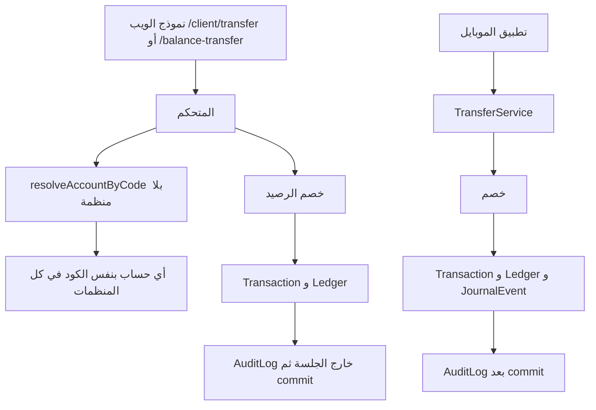
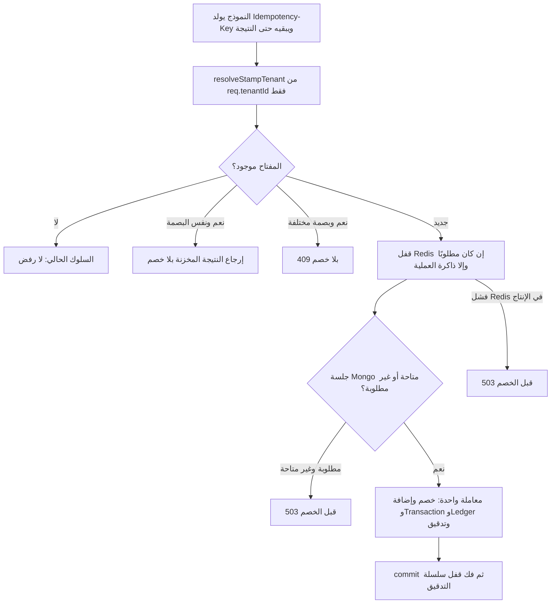

# مخطط حركة المال

## قبل التعديل

إعادة إرسال نموذج الويب بلا مفتاح يمكن أن تخصم مرة ثانية. بحث الكود لا يتوقف عند حد المنظمة.

## بعد التعديل والأعلام مطفأة

عند `FINANCIAL_TENANT_GUARD=true` تُضاف بوابة قبل الخصم: منظمة الطلب يجب أن تطابق حساب الخصم، وهدف تحويل الرصيد يجب أن يكون في المنظمة نفسها. غير ذلك 403/503 والرصيد لا يتغير.

إلغاء العملية ينشئ قيد `REFUND` أو `REVERSAL` ولا يعدّل القيد الأصلي. الإلغاء الثاني لا يضيف رصيدًا مرة أخرى.
